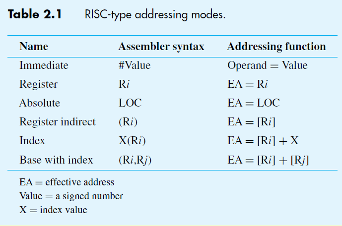
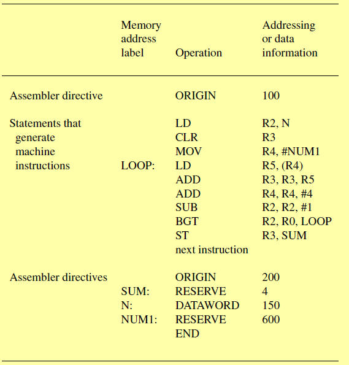
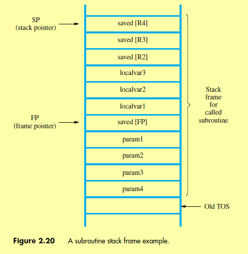

#### **RISC**
- Each instruction should be fit in a word
- Aims to make the hardware simple and move the complexity to the software
##### **Characteristics**
- Each instruction fits in **a single word**
- Cannot directly modify memory operands using arithmetic and logic operations 
	- Memory operands are only accessed through LOAD and STORE instructions
	- LOAD and STORE cannot have the source and destination as a memory location
- The operands for arithmetic and logic operation should be in a register or mentioned explicitly
- Example:
	- Register transfer notation: 
		- C <- \[A] + \[B]
	- Assembly language notation:  ```
	```
	LOAD R1, A
	LOAD R2, B
	ADD R3, R1, R2
	STORE R3, C
	``` 

#### **Instruction execution**
- Let's say the word length is 32 bits, each instruction occupies 4 bytes
	- First instruction will be stored in memory loc i
	- Second instruction will be stored in memory loc i+4 and so on
- The program counter(PC) initially point to the memory loc i
	- **Instruction Fetch**
		- The first instruction is fetched from memory location pointed by the PC and stored in the IR
		- The program counter is incremented by 4 bytes to point to the next instruction
	- **Instruction Decode**
		- Examine IR to determine operation to perform
	- **Instruction execution**
		- Instruction is executed
- Then the next instruction is fetched and executed

#### **Instructions in RISC** 
#TODO Add more info about the logical and arithmetic instructions 
- LOAD and STORE
	- Read from memory or write to memory
- MOVE
	- Move a value into the register
- CLEAR R1
	- Clear value in R1 and make it zero
- Branching instruction
	- **BGT** R1, R2 LOOP
		- Branch if \[R1] > \[R2] to address LOOP
	- **BNZ** R1 LOOP
		- Branch if non zero
	- JZ
	- JC
	- JNZ
	- JNC
- Logic instructions
	- AND
	- OR
	- CMP
	- XOR
- Shift instructions
	- Arithmetic shift
	- Logical shift
- Rotate instructions
	- Rotate with carry
	- Rotate without carry
- Arithmetic instructions
	- Add
	- Subtract
	- Increment
	- Decrement
	- Multiply
	- Divide
- **How is the address LOOP specified?**
	- Using different addressing modes explained below

#### **Addressing Modes**
- Different ways to specify the address location of an operand in the memory


#### **Assembler**
- Converts the assembly code to machine code
- **Assembly directives** - Statements used to provide assembler with additional information
	- ORIGIN 100
		- Specifies the assembler to place the next instruction in the memory address 100
	- NUM: RESERVE 4
		- Assembler reserves 4 bytes from NUM
	- NUM1: DATAWORD 150
		- NUM1 will be replaced by value 150
	- END 
		- End of program
	- TWENTY EQU 20
		- Assembly will replace all the occurrence of TWENTY with 20 
	
- Assembly program examples in attachments folder

#### Stack
- Stacks can be used to handle data from the program
- Stack is stored in the main memory
- The Top of the stack is stored in the Stack Pointer(SP)

#### Subroutines
- A block of instruction can be written as a subroutine
- Every time this block needs to be executed (function call)
	- The current value of PC is stored and the new value is updated 
- The new value of PC will point to the first instruction of the subroutine
- Once the execution of the subroutine is completed, the PC value that was stored previously is retrieved and execution continues 
- Passing parameters
	- Using register
		- Straight forward
		- Cannot be used when many parameters are used, registers are limited
	- Using the stack
- Operations performed during a procedure call. [Stack frame explained](https://redirect.cs.umbc.edu/~chang/cs313.s02/stack.shtml)
	- Lets take an example where the main function is the caller and a function foo is the callee. Here the foo function has three arguments and two local variables
	- Operations performed by the main function before calling the foo function
		- Push the contents of the registers it needs to preserve
		- Push the arguments from last to first
		- invoke the foo function 
			- This done by the call command
			- The call command pushes the current IP into the stack. This will be the return address
	- Operations performed by the foo function before executing its commands 
		- The foo function pushes the values of the general purpose registers into the stack. This is to preserve the values in these registers
		- The function needs to initialize the stack frame. For this step, the callee saves the frame pointer's value to the stack
			- The new value of the frame pointer will now store the Top of stack address (i.e. the address where the existing frame pointer is stored) 
		- The address in the frame pointer is used by the callee to access the arguments and local variables that will be allocated in the next step
		- Now the local variables are allocated in the stack, foo had two local variables 
		- Once space for the local variables are allocated, the callee can start its execution
	- Operation performed by foo before returning
		- Deallocate the local variables
		- The return value can be stored in a register or the function adds an extra argument that contains the address where the result is stored
		- Once the local variables are popped, the main function's frame pointer value is popped from the stack 
		- The general purpose registers the callee pushed will be popped from the stack
		- The ret command is called. This command pops the stack which gives the return address
	- Operation in main function after foo has returned
		- The main function deallocates all the arguments that it initializes. The extra argument will be the result of from the foo function
- Example stack frame
		

#### Program Execution Overview With assembler and loader
- Assembler converts the assembly code to the machine code and stores it in secondary memory
- The machine code is loaded into to the main memory by the loader and the first instruction execution is started
- First the instruction is fetched and stored in IR
- Contents of IR is examined to determine the operation
- Operation is performed
- Next instruction is fetched and executed


#### How is Control Unit affected by the instruction set 
- If RISC instruction set is used 
	- The Control unit is hardwired ([ref](https://en.wikipedia.org/wiki/Control_unit#Hardwired_control_unit)) 
