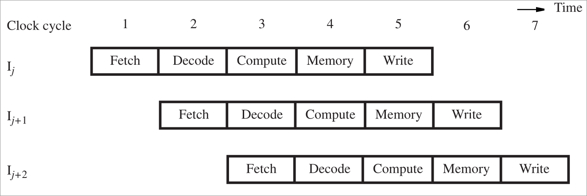

#### 1 Processor components

#### 2 processor components
##### 2.1 Register file
- **What is it?**
	- Fast memory block that contains an array of storage elements
- **How is it accessed?**
	- Reading data
		- Address line to select the register
		- Output line has the data present in the register selected by the address line
	- Writing data
		- Separate address line for selecting the register to write to
		- Input line that contains the datas to be written
- **How to obtain the register address?**
	- The IR register will contain the instruction opcode along with the operands
	- The operands can be register address or memory location based on the instruction opcode
##### 2.2 ALU
- **What is it?**
	- Performs Arithmetic and logical operations on the data
- **Where is the data obtained from?**
	- Contains two input: each connected to the output line of register file
- **Where is the result stored?**
	- The result of ALU will be the input to the register file input data
	- The destination register address can be obtained from the IR register

#### 3 Instruction execution steps
1. Fetch instruction and store it in IR
2. Decode the instruction
3. Perform the computation for the instruction
4. Read or write data if instruction involves memory operand
5. Write the result to destination register if needed

#### 4 Pipeline processor & Hazards
- Ideal pipeline execution 
- **Hazards**
	- Lets say instruction j and j+1 are the following
		- INC R1
		- ADD R2. R1
	- The j+1th instruction uses the result of jth instruction, this means the j+1th instruction should wait for the jth instruction to complete
	- Cases where the ideal pipeline execution cannot occur are called hazards
##### 4.1 Hazards due to data dependency
- **What is it?**
	- When one instruction depends on the result of another executing instruction
		- The instructions that needs the result from the executing instruction will be stalled until the other instruction completes execution
- **How to overcome stalling?**
	- Operand forwarding
		- #TODO 
##### 4.2 Hazards due to memory delay
- Memory access of an instruction can take more than one clock cycle (cache miss for example) 
##### 4.3 Hazards due to branch ops

#### 5 Evaluating performance of pipelined processors
#### 8086 Microprocessor
#TODO 