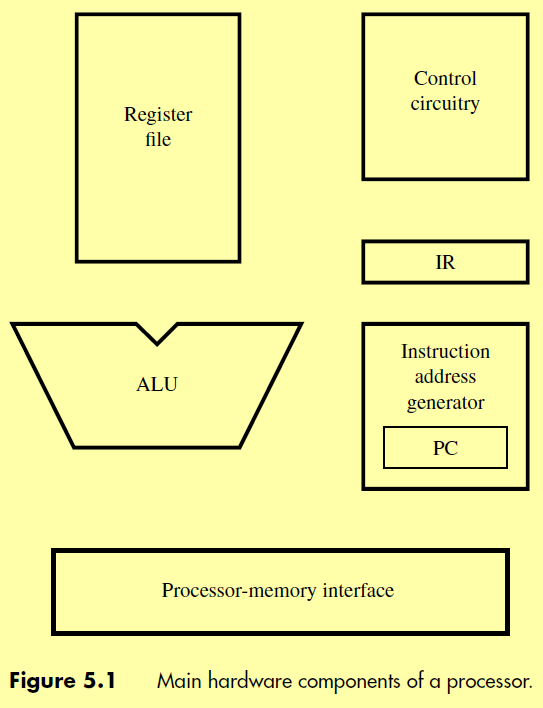

### Processor components

### Steps for Instruction execution
1. Fetch instruction and store it in IR
2. Decode the instruction
3. Perform the computation for the instruction
4. Read or write data if instruction involves memory operand
5. Write the result to destination register if needed

### 8086 Microprocessor
#TODO 