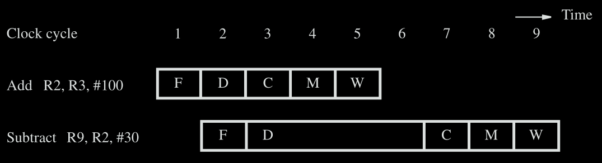
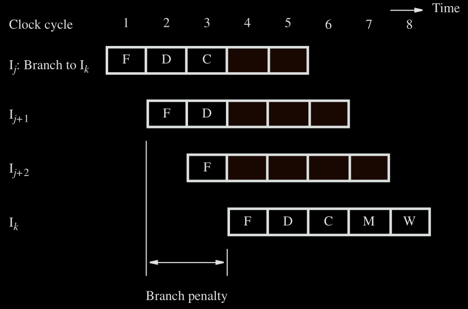
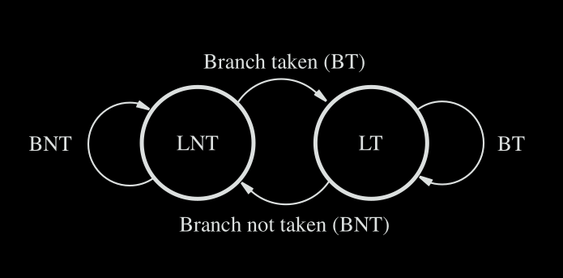

#### 1 Processor components

#### 2 Processor components
##### 2.1 Register file
- **What is it?**
	- Fast memory block that contains an array of storage elements
- **How is it accessed?**
	- Reading data
		- Address line to select the register
		- Output line has the data present in the register selected by the address line
	- Writing data
		- Separate address line for selecting the register to write to
		- Input line that contains the datas to be written
- **How to obtain the register address?**
	- The IR register will contain the instruction opcode along with the operands
	- The operands can be register address or memory location based on the instruction opcode
##### 2.2 ALU
- **What is it?**
	- Performs Arithmetic and logical operations on the data
- **Where is the data obtained from?**
	- Contains two input: each connected to the output line of register file
- **Where is the result stored?**
	- The result of ALU will be the input to the register file input data
	- The destination register address can be obtained from the IR register

#### 3 Instruction execution steps
1. Fetch instruction and store it in IR
2. Decode the instruction
3. Perform the computation for the instruction
4. Read or write data if instruction involves memory operand
5. Write the result to destination register if needed

#### 4 Pipeline processor & Hazards
- Ideal pipeline execution 
	- To enable the pipelined execution, there are intermediate registers between each stage
		- Due to these registers, executing a single instruction is faster in a non-pipelined processor compared to a pipelined processor
	- **How is the clock cycle determined in case of a pipelined processor?**
		- The clock cycle time = maximum time of a stage
		- Why is clock cycle time max of time required by the pipeline stage? 
			- This is because the pipeline has a bottle neck at the slowest stage
			- Having different clock cycles for each stage also requires using multiple clock which is not useful as the pipeline will anyway be stalled because of the slowest stage
		- What is the relation between clock rate and clock cycle time in a pipelined processor
			-  clock rate = 1/(clock cycle time)
				- Here again clock cycle time = max delay of all stages
- **Time required to execute instructions in a pipelined processor**
	- Formula
		- Execution time = (K + (N-1))Tmax, where 
			- K       = Number of stages in the pipeline
			- N       = Number of instructions to execute
			- Tmax  = The max(T | T is the time to complete a stage) this will also be the clock cycle time
	- **How is this formula derived?**
		- First instruction takes K*(Clock Cycle time) to complete
		- Every following instruction requires one additional clock cycle to complete
	- Reference questions: 
		- https://gateoverflow.in/399288/gate-cse-2023-question-23#a_list_title

- **Hazards**
	- **What is it?**
		- Any case that causes the pipeline to stall is a hazard
	- **Example**
		- Lets say instruction j and j+1 are the following
			- INC R1
			- ADD R2. R1
		- The j+1th instruction uses the result of jth instruction, this means the j+1th instruction should wait for the jth instruction to complete
##### 4.1 Hazards due to data dependency
- **What is it?**
	- When one instruction depends on the result of another executing instruction
		- The instructions that needs the result from the executing instruction will be stalled until the other instruction completes execution
- **How to prevent stalling in this case?**
	- Example data hazard
		- Instructions:
			- ADD R2, R3, #100
			- SUB R9, R2, #30
		- Data hazard: 
			- Second instruction uses the result of first instruction
			- The result is stored in R2
				- The result will be written to R2 only on the 5th clock cycle (step 5 in pipeline writes the results to the register)
			- The second instruction should be stalled until the first instruction completes
		- Pipeline execution: 
	- **Approach 1: Operand forwarding**
		- Use the values in the intermediate register
		- In the above example:
			- The result of the first instruction is available at the end of the 3rd clock cycle in the intermediate registers
			- Use the value from this intermediate register instead of waiting for the first instruction to write the result to R2
			- This completely eliminates the stalling of the second instruction
	- **Approach 2: Handling the data hazard through software**
		- The compiler can identify the data dependency and insert NOP operations
			- This simplifies the pipeline hardware, but the instruction execution time is still higher due to stalling
		- The compiler can reorder instructions and execute these instruction instead of the NOP operation
##### 4.2 Hazards due to memory delay
- **What is it?**
	- Memory access of an instruction can take more than one clock cycle 
		- Cache miss can cause the memory operation to take more than one clock cycle
- **How to prevent stalling in this case?** 
	- This can be prevented by reordering an instruction between the load operation and the instruction that uses the result of the load operation
		- If no instruction can be found by the compiler to reorder, then
			- The pipeline is stalled by hardware if pipeline can handle dependency or
			- Compiler inserts NOP operation if pipeline does not handle dependency
##### 4.3 Hazards due to branch ops
- **What is it?**
	- The instructions that are fetched after fetching the branch instruction are discarded
		- The branch address is computed at the compute stage(3rd stage) of the pipeline
	- Example timing diagram 
- **How to prevent stalling in this case?**
	- **Move effective address calculation to the decode stage**
		- Compute the branch address in the decode stage
		- This reduces the branch penalty to 1 clock cycle
			- The delay when the address is calculated in the compute stage will be 2 clock cycles
	- **Delayed branching**
		- To remove the 1 clock cycle branch penalty
			- The compiler can move an instruction that will always be executed (no matter if the branch condition is true or false) after the branch instruction
			- If a compiler cannot find such instruction a no op instruction will be added 
	- **Branch predication**
		- A state machine can be used to predict if a brach will be taken or not
			- The state transitions occurs based on the outcome of the most recent branch instruction
		- Example two state machine for branch prediction 
			- LNT: Branch likely not taken
				- Next branch is predicted as not taken i.e. the instruction at the brach address is not fetched
			- LT: Branch likely taken
				- Next branch is predicted as taken
##### 4.4 Anti Dependence
- Write after reads #TODO-Extras 

#### 5 Evaluating performance of processor
- Basic performance equation = (N\*S)/R
	- N: Number of dynamic instructions
		- If there is a loop that executes 10 times, the number of dynamic instructions will be 10*(number of instructions in the loop)
	- S: Average clock cycles required for instruction execution
	- R: clock rate -> number of clock cycles per second
- Instruction throughput for non pipelined processor = R/S
- Instruction throughput for ideal pipelined processor = R
	- In case of ideal pipelined execution, 1 instruction will be executed every clock cycle -> instruction throughput = R
- Instruction throughput of pipelined processor
	- instruction throughput = R/(1+δstall+δbranch_penalty+δcache_miss)
		- S = 1 is the ideal case
		- δhazard is the additional clock cycles required because of the hazard
	- Speed up of x over y = (execution time of x)/(execution time of y)

#### 6. 8086 Microprocessor
#TODO-Extras  