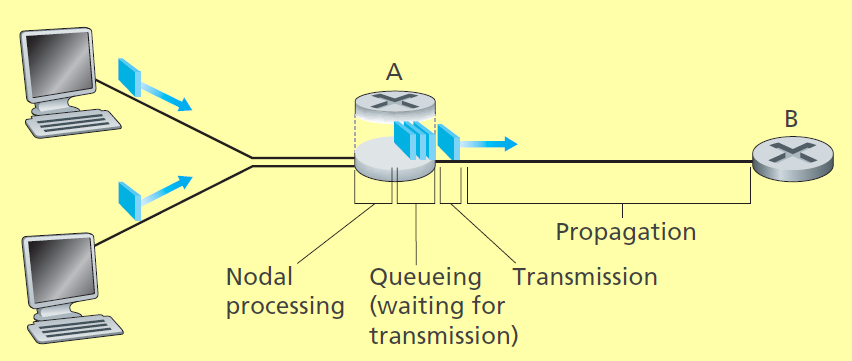

#### 1 Computer network
- Connection of various computers/devices
- Constitutes of 
	- Network edge (hosts) - run an application
		- Client
		- Server
	- Network core
		- The devices that connect everything
		- Types
			- Packet switched
				- A physical link can be used for connecting multiple devices
			- Circuit switched
				- One link is allocated for a pair of device
				- Sharing a physical link
					- Time division multiplexing
					- Frequency division multiplexing

#### 2 Internet Network structure
- Example: 
- Access ISP (Tier 3)
	- End devices connect to this ISP
	- Can be a university, telecom company etc
	- Multi homing
		- Each access ISP can connect to two ISPs of higher tier
	- Access ISP pays to the higher tier to which is connected
- Regional ISP (Tier 2)
	- Multiple access ISP in a region connect to regional ISP
	- Regional ISP connects to the Tier 1 ISPs
	- Peering
		- Two regional ISP connect to partially bypass the Tier 1 ISP
- ISP (Tier 1)
	- Top of hierarchy and connect all the regional ISPs
	- IXP (Internet Exchange point)
		- Consists of switches for multiple ISPs can connect
		- Non profit organization
	- Peering
		- Two ISP can mutually connect to each other
- Content providers
	- Connect directly to the regional and access ISP when possible
	- Have their own servers across the globe with their private network
	- Example: 
		- Google
		- Cloudflare

#### 3 Delay in packet switched networks
- There are various delays when packet is transmitted over the internet 
- Total delay is sum of
	- Nodal processing delay
		- Each packet needs to be processed before forwarding
			- The processing is required to determine to which link the packet is sent to
			- The link is determined using a forwarding table
	- Queuing delay
		- Includes store and forward delay
			- A packet can be transmitted only after it is fully received and processed
		- Queuing delay
			- The router has a buffer to store the packets
			- When the buffer has packets and a new packet arrives, the new packet has to wait until the old packets are transmitted
	- Transmission delay
		- Calculated using link transmission rate(R bits/second) and packet size(N bits)
			- The transmission delay will be N/R seconds
	- Propagation delay
		- Calculated Signal speed(S) in physical medium and link length(LL)
			- Propagation delay = LL/S

#### 4 Throughput of computer Networks
- **What is throughput?**
	- Performance measure like total delay and packet loss
	- **Instantaneous throughput**
		- Calculated at any point in time
		- Rate at which host receives the packet
			- Same as link transmission rate
			- If there are multiple transmission rates
				- The effective transmission rate will be the least transmission rate of all links
	- **Average Throughput**
		- If file is F bits
		- T is the time taken for all F bits to reach the destination 
		- Avg throughput = F/T