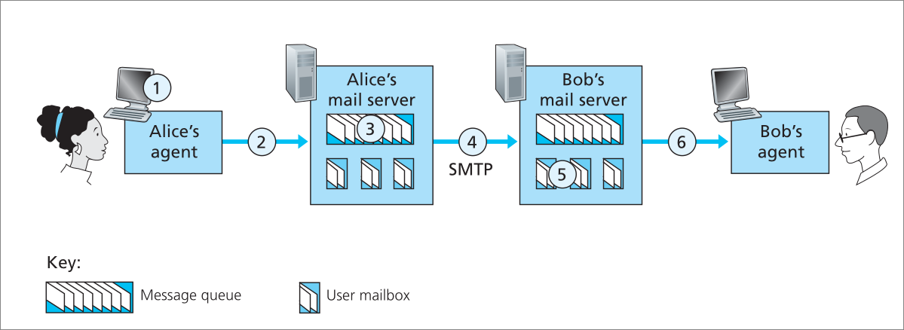
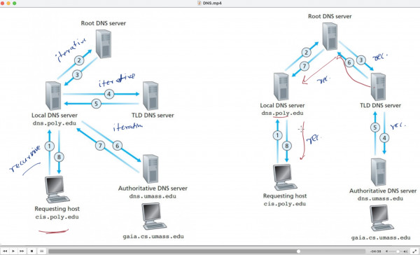

#### 1 Web application Architectures
- Client server architecture
- P2P architecture

#### 2 Sockets
- Two process on different hosts communicate with each other
- **What are sockets?**
	- Sockets are the software interface between process and the network
	- Any message to or from the process will be through the sockets
- **In which layer sockets operate?**
	- Sockets are an interface between Application and transport layer
- **Process addressing**
	- Host: identified using IP address
	- Process: attached to a port
- **Types of communication the process can use**
	- TCP
		- Connection oriented protocol
			- TCP handshake -> TCP connection -> Connection tear-down
		- Reliable data transfer
		- Provides congestion control
	- UDP
		- lightweight protocol
		- Connection less

#### 3 Application layer protocols
- **Purpose**
	- Defines how messages are passed between two processes
	- This is specific to each application
- **What does application layer protocols define?**
	- The format of request and response messages shared between two hosts
	- Syntax and semantics of the fields of the messages
	- Request and the appropriate responses
- **Does the Application layer protocols check for errors in the message?**
	- No, the messages are not checked for any bit errors
		- This is different from validation which checks the syntax of the message
	- These protocols assume that the network is error free
- Various application protocols
	- Web: HTTP
	- Email: SNMP, IMAP, POP
	- File transfer: FTP
	- Directory service: DNS
	- P2P

##### 3.1 HTTP
- **Where is this used?**
	- Client requests a web page form the server (i.e. file transfer)
		- **How to request web page?**
			- Defined in HTTP protocol 
	- **How does the client know the server?**
		- The server is identified using a URL
			- URL ( \http://www.someSchool.edu/someDepartment/picture.gif ) consists of 
				- host name: \www.someschools.edu
				- path name: everything after the host name
	- The client sends a HTTP request message -> server sends a HTTP response 
- **Is HTTP connection less?**
	- No, HTTP uses TCP as the underlying transport protocol
		- TCP establishes a connection between the hosts
		- 1 RTT is required to establish a TCP connection
- **HTTP Request syntax**
	- Request line:
		- HTTP method: (GET, PUT, POST, DELETE)
		- URL
		- HTTP version
	- Request headers
		- Has various fields like client program, accepted language, accepted file format
- **HTTP Response syntax**
	- Status line
	- Headers
	- Response body Data
- **HTTP pipelining**
	- Reference: [Mozilla documentation](https://developer.mozilla.org/en-US/docs/Web/HTTP/Connection_management_in_HTTP_1.x)
	- Client sends multiple requests over the same TCP connection without waiting for the response of the sent requests 
	- Server sends multiple files over the same TCP connection

##### 3.2 FTP (File transfer Protocol)
- **Where is it used?**
	- Transferring files to and from a remote host
- **Why a separate protocol when HTTP can be used for File transfer?**
	- FTP uses two TCP connections. Each are used for 
		- Control connection 
		- Data connection
			- Each file is sent over a separate data connection
- **Is FTP stateful?**
	- Yes, FTP is stateful
	- Example: State is necessary to track the user login and auto logout after a particular time
- **What happens when user requests file?**
	- A FTP client establishes a TCP connection(control connection) with the FTP server
	- FTP client sends the user credentials and file required
	- FTP server validates user, establishes a data connection with client
	- Each file will be sent in a dedicated Data connection

##### 3.3 Email Protocols 
- **Where is it used?**
	- User agent: client application 
	- Mail server: server application
	- User sends a mail to another user using the client application
		- The email is stored in the mailbox of the recipient
			- The recipient mail box can be in a different mail server
			- SMTP is used to transfer between mail servers 
		- The recipient uses their user agent to poll their mail box
- **SMTP (Simple mail Transfer protocol):**
	- Uses TCP connection
	- This is a push protocol i.e. it is used to send and forward the email
	- This cannot be used by the recipient to retrieve an email from the mail server
	- Flow diagram: 
- **POP(Post office protocol) and IMAP(Internet Mail Access Protocol)**
	- Protocols used for retrieving emails from the mail server
	- POP: 
		- Stateful protocol used to download the message from the server
		- Deletes the mail after it is retrieved from the mail server
		- POP3 has two modes that allows users to keep mail in the server even after retrieval
	- IMAP: 
		- Stateful protocol used to organize messages in the remote server
		- Can also retrieve the emails form the mail server
		- Messages are organised in folders in the remote server 

##### 3.4 DNS
- Directory service that translates host names to IP addresses using UDP protocol
- **Host name** [RFC 1983](https://datatracker.ietf.org/doc/rfc1983/)
	- Name given to a machine (server or a PC)
	- Example host name: relay.foo.bar.com
- **Canonical host name**
	- #TODO 
- **Fully qualified Domain name** [RFC 1983](https://datatracker.ietf.org/doc/rfc1983/)
	- Full name given to a host
	- A fully qualified domain name (webserver.mywebsite.com)
		- The first part refers to a host name
			- Hostname is a name given to a individual machine
		- mywebsite is the domain name
		- .com is the top level domain
- **Domain name** [RFC 1983](https://datatracker.ietf.org/doc/rfc1983/)
	- Style of the host name is called domain name
- **DNS Server architecture**
	- Consists of a three level hierarchy
		- Root Domain server: 
			- When a DNS resolution request is received, Root server returns the address of a Top level Domain DNS server
			- These are a collection of servers distributed globally
		- Top level Domain(TLD) DNS:
			- When DNS resolution request is received, this server sends the address of the Authoritative server that matches the domain name
			- Each TLD will have a collection of servers
				- TLD examples: .org .edu .com 
			- Each top level domain can be maintained by a company
		- Authoritative DNS
			- This contains the URL to IP mapping
			- Companies can have their own authoritative server or pay other companies that maintain authoritative server
	- Local DNS (default name server)
		- Another central component of the DNS Arch
		- Maintained by local ISP
		- Acts as a proxy for forwarding the DNS request
		- When a host connects to an ISP, the host receives an address of a local DNS server
- **Does the DNS Architecture always have three levels?**
	- Yes, but the requests sent to the DNS server depends on the URL
	- Example:  for the domain name \www.gate.org.in
	- When A DNS resolution is required for this name
		- There will be 4 request response pairs from local DNS to DNS servers
			- 1st request: To root DNS
			- 2nd request: to TLD DNS of .in
			- 3rd request: to TLD DNS of .org
			- 4th request: to Authoritative DNS
- **What happens when a host requires the IP of the domain \www.something.edu?**
	- Host connects to the internet via the ISP
	- ISP provides the host with an IP addr of a local DNS
	- The host sends a DNS request to the local DNS with the domain name \www.something.edu
	- The local DNS forwards this request to the root DNS server 
		- Root DNS server finds the .edu in the request and sends the IP of a TLD DNS server as the response
	- The local DNS server sends the domain name to the TLD server
		- The TLD DNS server sends the IP address of an authoritative server that matches the domain name as the response
	- The local DNS server then sends the domain name to the Authoritative server
		- The authoritative server returns the ip address of the corresponding domain
	- The local DNS server sends the IP address to the host
- **Problem with the above method of Domain name resolution**
	- A lot of request and response is required for the domain name resolution
		- **How to over come this problem**: DNS Caching
- **DNS Caching**:
	- Cache domain name mappings 
	- Each domain name mapping is invalidated after a period of time
- **Types of DNS Resolution queries**
	- Iterative
		- Request for DNS resolution, immediately get back an IP which can be IP of another DNS
		- The local DNS host resolves DNS using this method
			- The local DNS host sends the request to root DNS, then gets a result from root DNS for a TLD DNS
			- Then request to the TLD DNS and receive Authoritative DNS and so on
	- Recursive 
		- When a request is sent to the local DNS, the local DNS does not immediately return the IP, instead the local DNS sends another series of request and then sends the result to client
		- When the result is not received immediately(i.e. this request will trigger series of requests, then final result is received)
	- Example: 
- **DNS Record**
	- A DNS record consists of 4 attributes:
		- Name
			- Domain name
		- Value
			- IP address
		- Type
			- Specifies what IP address is stored
		- TTL
			- Time to Live
	- **Possible values for Type attribute**
		- Type = A
			- The name contains a host name
			- The value contains the IP address of the hostname
		- Type = NS (Name server)
			- The name contains a domain name
			- Value contains the hostname of the authoritative DNS server that knows the IP address of the domain name
		- Type = CNAME (Canonical name record)
			- The name contains a host name
			- Value consists of a canonical host name
		- Type = MX
			- Name = host name of mail server
			- Value = canonical host name of mail server

##### 3.5 P2P
#TODO 

#### 4 Other protocols
##### 4.1 Ping
Refer: [[4.3 ICMP#1 ICMP (Internet control message protocol)]] 

##### 4.2 WPA (Wifi Protected Access)
#TODO-Extras  

#### 5 DNS Cache population and cache poisoning
#TODO-Extras 
