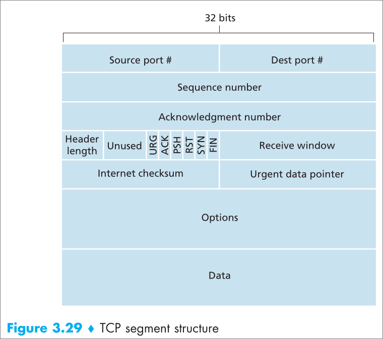
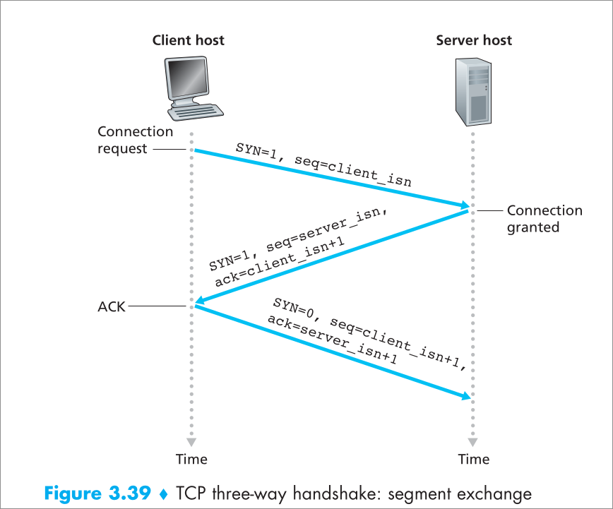
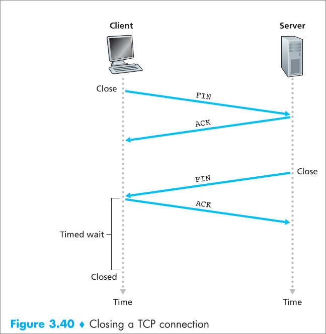

#### 1 TCP - Transmission control protocol
- [RFC 9293](https://datatracker.ietf.org/doc/html/rfc9293)
- Features
	- Full duplex
	- Connection oriented
	- Reliable data transfer
	- Point to point
		- Connection can exist only between two Processes
		- No multicasting 
- Uses the methods described in [[3.2 Principles for Reliable data transfer]]

#### 2 TCP Connection Overview
- **What is it?**
	- Handshake is required between two process
		- Without this two process cannot communicate
			- Client: host that initiates the connection
			- Server: host that accepts the connection
	- Handshake is used to 
		- Initialize TCP state vars
		- Allocate buffers  
	- Once Handshake is completed, a logical connection is established
		- **What is logical connection?**
			- This is not a connection similar to circuit switched network 
			- The network core between two process does know about this connection
- **Connection Characteristics**
	- Point to point
		- A TCP connection is only between two processes
		- The cannot be more than two processes involved in a TCP connection
	- Full duplex
		- Two process in TCP connection can exchange data at the same time
- **How is a connection established?**
	- Using  a three way handshake [[3.3 TCP#8 Three way handshake]]

##### 3 Sending data overview
- Both processes have two buffers
	- Send buffer
	- Receive buffer
- The client sends data through the socket
	- The data is stored in the send buffer
	- TCP grabs chunks of data for the send buffer
		- MSS - Maximum Segment size
			- The max size of the **application data in a segment**
		- MTU - Maximum transmission unit
			- The maximum size of the link layer frame
			- This is determined first
				- Using the MTU the MSS is determined
			- The max size of application data and TCP headers and 1
	- TCP creates a segment
		- Add source port and destination port
		- Add error checking bits
		- Add TCP Headers
	- TCP sends the segment to subsequent layer
- The receiver application gets the data form the receive buffer
	- The TCP check for errors and constructs the data 
	- Once data is received the TCP sends the data to the destination socket address present in the headers and to the receive buffer for the application
	- Server process fetches  the data form receive buffer and does it's processing

#### 4 TCP Segment Structure

- Source/Destination port
	- Size: 16 bits each
- Sequence Number
	- Size: 32 bits
	- Contains the Sequence number for segment
	- **How is seq num generated?**
		- Seq num is for each byte of application data and not for a TCP segment
		- If data is 1000 bytes and MSS is 500
			- Total number of segments is 4
			- The first segment num is x
				- x is a randomly chosen initial seq num (ISN)
			- The second segment num is x+500
				- As the first segment hass 500 bytes of data, the second segment will have the data from byte 500 (0 indexing)
			- third segment num is x+1000 and so on
- Ack number
	- Size 32 bits
	- Contains the next sequence number the receiver is expecting
	- If the receiver received the seq num x
		- ACK num will be  the next segment the receiver is expecting
			- x+MSS -> x+500
		- The MSS is already known to both process by handshake 
- Header length:
	- Size: 4 bits
	- Specifies TCP header length in 32 bit words
	- if header length is 0011
		- TCP header size will be three 32 bit words -> 96 bits
- Options field
	- Optional and has variable length 
	- Used when negotiating the MSS
	- Contains the fields like time stamp for high speed networks
- Flag field: 
	- 6 flags each 1 bit
	- Flags
		- ACK: Indicate the ACK num in header is valid
		- RST: 
			- Reset flag
			- When client sends SYN packet but the server does not accept connection on the port, the server sends a special segment with RST bit set to 1
		- SYN: connection setup
		- FIN: connection teardown
		- PSH: informs TCP to send data to upper layer immediately
		- URG:  TCP informs urgent data present, TCP sends URG pointer field to upper layer
- Urg pointer
	- 16 bit 
	- Indicates the last byte of urgent data
- Check sum: error checking
- Receive window
	- 16 bit 
	- Used for flow control
	- Indicates the number of bytes receiver is willing to accept

#### 5 Timeout & Round trip time estimation
- Sample RTT
	- Time taken form sending segment to Network layer to receiving an ack for the segment
- Estimated RTT = (1-alpha)Estimated RTT + alpha\*sample RTT 
	- alpha = 0.125
- Deviation from Est RTT
	- dev RTT = (1-beta)dev RTT + beta\*|sample RTT - Est RTT|
	- beta = 0.25
- Time out = Est RTT + 4\*dev RTT
	- TCP uses a single timer instead of timer for each packet
	- One timer is used because managing multiple timers can cause overhead
	- Once a timeout occurs, the time out is doubled
		- The timeout is calculated again when the ack is received

#### 6 Duplicate ACK and fast retransmit
- If the receiver receives a segment out of order
	- The receiver sends an ack for the next in order seq num 
	- even if this ack is already sent, the sender interprets it for fast retransmission
- When sender receives duplicate ack for the latest ack segment
	- the sender understands that some segment reached the receiver out of order
	- The sender sends the segments immediately before the time out occurs
		- This makes sure the receiver does not wait for long time because of the time out

#### 7 Flow control
- Mechanism used to prevent the overflow of receive buffer
- The receive window in the header field is used to denote the free space in the receive buffer
- When receive window is 0, the sender sends one byte of data until the receive window has non zero value in the ack for the byte the sender sent

#### 8 Three way handshake

#### 9 Closing Connection

