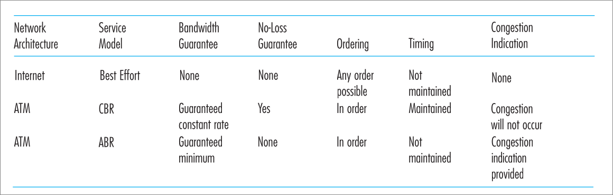

#### 1 Role of Network layer
- End to end connection
- **What is the data called in this layer?**
	- Packets/datagrams 

##### 1.1 Functions network layer 
- Forwarding
	- Router forwards packet from input link to the correct output link
	- Router has a forwarding table that determines the output link of the packet
- Routing
	- Network wide process of determining path from source to destination
	- Routing algorithm is used to populate the forwarding table in the routers
- Connection setup 

#### 2 Network Service Model
- Similar to a service level agreement
	- Characteristics of the protocol (reliable, orderly delivery of packets etc.)
- This depends on the network layer protocol
	- Example the IP protocol does not guarantee packet delivery

#### 3 Connectionless and Connection oriented protocols
- Network layer protocols can also be connectionless or connection oriented
##### 3.1 Datagram Network
- Characteristics
	- Connection less 
	- There is no handshaking in the network layer
- How does the router forward
	- The router forwards the packet based on the destination address
- Entry format for forwarding table 
	- Each destination address prefix will have a outgoing interface number
	- Entry contains
		- Destination address prefix
			- Let 001 & 000 can be reached though interface 1
			- The entry will be <addr_prefix: 00, interface: 1>
			- This reduces the number of entries in the forwarding table
		- Output interface to forward the packet
##### 3.2 Virtual Circuit Networks 
- Characteristics 
	- Connection oriented 
	- During handshake create entries in forwarding table of routers along the path from source to destination hosts 
- How does the router forward 
	- Each packet contains a virtual circuit(VC) number
- Entry format for forwarding table 
	- Each connection will have an entry 
	- The entry contains 
		- Incoming VC num 
		- Incoming interface
		- Outgoing VC num 
		- Outgoing interface

#### 4 Internet's Network layer
- This is specific to the internet 
	- Other networks(such as ATM) will have a different protocols
- Internet's Network layer Components 
	- [[4.2 IP protocol]]: forwarding, addressing, packet format, packet handling conventions
	- [[4.3 ICMP]]: Error & information reporting protocol
	- [[4.4 Routing Algorithms]]: populate forwarding tables

