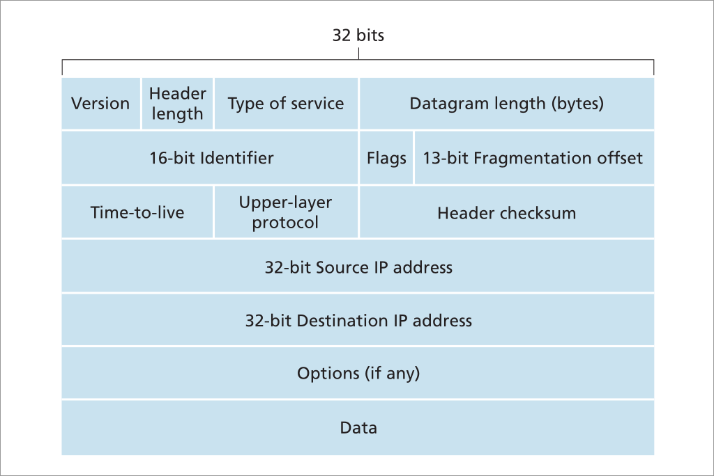

#### 1 Purpose 
- The IP protocol has the conventions for addressing and data format
- The IP has two versions
	- IPv4 
	- IPv6

#### 2 **Datagram format in IPv4** 

#### 3 IP Fragmentation
- **What is it?**
	- This makes it necessary to break IP packets into smaller sizes
- **Why is it necessary?**
	- The MTU for all links are not the same
	- MTU can one link can be smaller than another link making it necessary for fragmentation
- **What is MTU?**
	- Maximum transmission unit is the maximum size of the link layer frame 
	- This restricts how large a IP datagram can be
- **How is the MTU determined?**
	- [[5.1 Link Layer]]
- **Is fragmentation always possible?**
	- Only IPv4 allows fragmentation at routers
	- In IPv6, Fragmentation is only allowed in the source host
- **Where are the fragments assembled together?**
	- The fragments are assembled in the destination host network layer
	- **What happens if a fragment is lost?**
		- The packet that was fragmented is sent again 
	- **Why not send only the fragment?**
		- IP does not guarantee packet delivery
		- The TCP is responsible for sending packet but the fragmentation is transparent to TCP protocols
		- This makes it necessary to transmit the entire packet only if a fragment of the packet is lost
- **How is the fragmentation done?**
	- Each packet will have an id
	- When a packet needs to be fragmented, the fragments have the ID of the original packet 
	- So packet with ID 100 is fragmented into 3 fragments
		- Each fragment will have the same ID = 100
		- Each fragment eill have an offset that will be used to reassemble the datagram
		- There are flag bits to indicate the last fragment of the datagram 
- **How is the offset and flag used?**
	- Offset
		- The offset is based on 8 bytes of IP datagram **data**(similar to how TCP sequence number is based on 1 byte) 
		- Example
			- Firsts fragment(256 bytes) will have offset 0. 
			- Second fragment wiill have offset of 256/8 = 32
		- This implies that all the fragments except the last one should be a multiple of 8
	- Flag 
		- Flag will be set to 0 for the last fragment of a packet
		- All other fragments will have flag=1
- **Example**
	- Reference question: https://gateoverflow.in/204129/gate-cse-2018-question-54#a_list

#### 4 IPv4 Addressing
- **Does each host and router get a unique IP address?**
	- No 
	- Each network interface will be assigned an IP address 
- **Format**
	- 32 bit address
	- 0.0.0.0, 255.255.255.255
- **Subnet**
	- Subpart of a network that is connected to the router 
	- **How to identify subnets in a network?**
		- Each link to router will form a subnet
			- Subtract the common links between routers if two routers are connected 
		- Reference: [Gate question](https://gateoverflow.in/371924/gate-cse-2022-question-12#a_list_title)
- **How to assign IP addresses**
	- A block of address is allotted for a sub-network
	- The block of address that is same for the sub-network will be represented using a subnet mask
	- The subnet address can be 205.1.1.X
		- Here all the devices in the network will have the same first 3 bytes of address
		- This subnet mask is represented as 255.255.255.0 -> the starting 24 bits are same
		- the shorthand notation is 205.1.1.0/24
			- The first /x bits are called prefix
- **Is subnet subnet mask always in 1 byte form?**
	- Classless interdomain routing (CIDR)
		- In this notation subnet can involve any number of bits
	- Classful IP address
		- The subnet should always be a multiple of 1 byte. Valid subnets
			- Class C: 255.255.255.0
			- Class B: 255.255.0.0
			- Class A: 255.0.0.0
- **Who is responsible for assigning the IP addresses?**
	- For an individual the ISP assigns the IP Addresses
	- The the addresses the ISP uses is decided by ICANN
	- Within a sub network that is assigned a block of IP(Lets say for an organisation)
		- Each host can be statically configured with an IP address or
		- Use DHCP to  dynamically configure the IP addresses
- **Forwarding when using subnets**
	- When forwarding happens outside the a subnet, only the prefix is used in the forwarding table 
	- Inside the sub network the remaining remaining bits is used to identify the hosts  

#### 5 DHCP 
- DHCP also provides the host joining a network with its
	- IP address
	- Subnet mask
	- Address of First-hop router
		- Any packet a host sends will be sent to this router
	- Address of local DNS
- DHCP uses a client server architecture
	- Client: host joining network 
	- Server: DHCP server
- **Steps involved when host joins a network**
	- DHCP Discovery
		- Host that newly joined the network has to find the DHCP server
		- The host sends a UDP DHCP discover message with 
			- Source address as 0.0.0.0
			- Destination address as 255.255.255.255 -> broadcast address 
	- DHCP Offer
		- There can be many DHCP servers in a network, all the servers that received the DHCP discover message broadcasts a DHCP offer
			- This offer is broadcasted instead of send to 0.0.0.0 because there can be two new hosts joining the network at the same time
		- The offer includes the following fields
			- The src addr: IP address of the DHCP server 
			- The dest addr: 255.255.255.255 -> broadcast address
			- Transaction id: assigned to a request response pair 
				- The request and the corresponding response will have the same ID 
			- Life time: how long the IP address is valid
			- Subnet mask
			- Your IP address: The address the new host will be assigned
	- DHCP request
		- Client sends a DHCP request based on the offer
	- DHCP ACK
		- The server sends an ack back to the client 

#### 6 NAT(Network address translation)
- Method used to address the shortage of IPv4 addresses
- NAT can be enabled in a router
- In a sub network using NAT
	- The subnet will use private addressing
	- The private addresses are reserved and any host on the internet cannot have this public IP addresses 
		- 16 bit block: 192.168.0.0 to 192.168.255.255
		- 20 bit block: 172.16.0.0 to 172.31.255.255
		- 24 bit block: 10.0.0.0 to 10.255.255.255
- **Host addressing**
	- All the hosts within the sub network will use the private addresses
	- There is only one public IP address and it is assigned to the NAT
	- Any packets outside the sub network will be sent to the NAT
		- Hosts outside the sub network is oblivious of the sub network
		- NAT acts like the host instead of a router to hosts outside the sub network 
	- The NAT will process the packets and send to the host 
- **Sending a packet from a host**
	- When a host behind a NAT router sends a packet, the NAT router receives the packet
		- Host packet will have source address as its private IP addr and port number as a random assigned port number 
	- When the NAT router receives this packet, it modifies the source address with its public IP address and the original port number to another number 
		- This changes is indexed in a NAT transition table 
		- This table contains 
			- the public IP address and the modified port number as key
			- The value will be the private IP address and the original port number
	- After changing the src IP addr and port numbers and adding an entry in its forwarding table, NAT router sends the packet 
	- When a packet is received by the NAT router
		- A lookup is done on the NAT transition table based on src ip addr and port number
		- The lookup result is the host private IP addr and the original port number
		- The NAT modifies the source IP addr and port to the original values that were set by the host and sends it to the host in the sub network  
	- As port number is a 16 bit number, each public IP of NAT can support 216 entries in the NAT transition table 

#### 7 IPv6
- **Purpose**
	- IPv4 addresses were running out 
	- IPv6 can be used when IPv4 addresses are depleted  
- **Format**
- **IPv4 vs IPv6**
	- IPv6 address is 128 bits
	- Options are removed from IPv6 
		- This makes IPv6 headers of fixed length of 40 bytes
	- IPv6 does not support fragmentation
		- When packet size is bigger than MTU, ICMPv6 "packet too big error" is sent to sender 
		- This makes the forwarding in each router faster
	- IPv6 does not have check sums
		- Upper layer protocol like TCP already performs error checking
		- This is redundant so it was removed
	- Traffic class is similar to the Type of service in IPv4 
	- Next header is similar to the upper layer protocol in the IPv4 (if data is for TCP/UDP/ICMP)
	- Hop limit: 
		- Similar to TTL in IPv4 
		- Decremented in each router. packet is dropped when this is 0

##### **Transitioning from IPv4 to IPv6**
- **Problem**
	- Infrastructure created before IPv6 are not compatible
	- New Infrastructure support both IPv4 and IPv6
- Approach 1: if router does not support IPv4 convert IPv6 packets to IPv4 **(not feasible)**
	- Let the source and destination routers support IPv6
	- source and destination routers are interconnected by IPv4 routers
	- This meas the IPv6 packet will be converted to IPv4 packets
		- The additional fields in the IPv6 headers are lost
- Approach 2: Tunneling **(feasible)**
	- Encapsulate the entire IPv6 packet including the header in a IPv4 packet
	- The routers that support only IPv4 can forward the packet normally
	- The router that supports IPv6
		- Extracts the IPv4 packet to get IPv6 packet
		- This IPv6 packet is then used for routing
