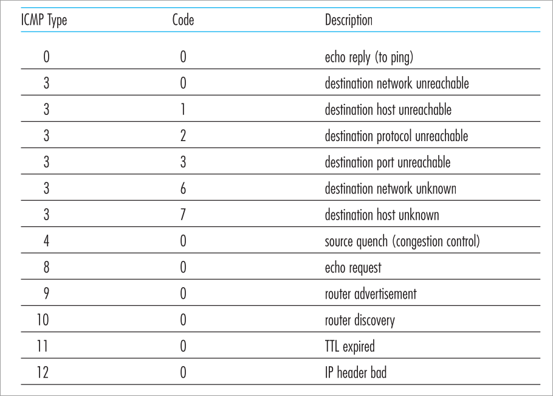

#### 1 ICMP (Internet control message protocol)
- **In which layer does this protocol operate in?**
	- This protocol is a part of the internet's network layer
	- The ICMP is built on IP protocol
		- The ICMP data will be encapsulated in an IP datagram (similar to TCP/UDP)
		- The upper layer protocol for ICMP packets will be ICMP
			- in case of TCP, the upper layer protocol IP header will have the TCP as the value
- **Purpose**
	- Used by hosts and router to communicate network layer info 
- **What are the contents of the ICMP message?**
	- Type 
	- Code 
	- The header and first 8 bytes of IP packet that led to ICMP message
- **Application**
	- Error reporting 
	- Ping uses ICMP 
		- When `ping <URL>` used the source host sends ICMP Type 8 code 0 message
		- The destination host sends ICMP Type 0 code 0 message as a reply
- **ICMP Codes**
	- The following are the ICMP codes 

#### 2 ICMPv6
- Introduced along with IPv6 
- Has additional code and types like packet size too big
- #TODO-Extras 
