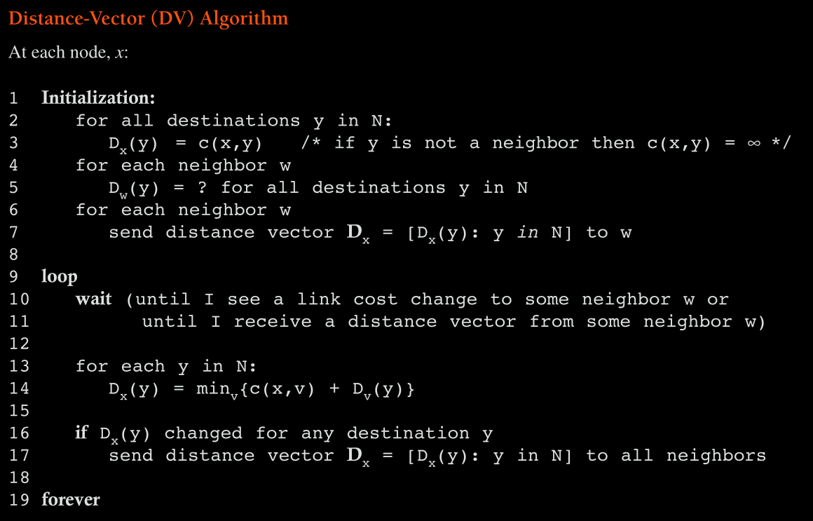
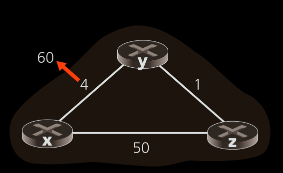

#### 1 Routing 
- **What is it?**
	- Find a good route between source router and destination router
- **What is source and destination router?**
	- Source router: The first hop router of sender
	- Destination router: The first hop router of receiver
- **What is a good route?**
	- Route with minimum cost 
- **Representing routing in terms of graph**
	- Graph G has nodes N(routers) and edges between two nodes(physical link) with a cost associated with it
- **How to calculate edge cost?**
	- Depends on routing algorithm
		- RIP uniform costs for all links (this will give the shortest path)
		- Make link cost inversely proportional to the link bandwidth
			- This makes sure link with high bandwidths are used 
		- Edge cost can be associated with physical link length or speed

#### 2 Categories
##### 2.1 Distributed Vs Centralized routing algo
- Distributed 
	- Node has the link cost of only its direct links
	- Least cost path is found iteratively
	- Example: Distance vector routing
- Centralized
	- Also called link state algo
	- The complete information about the connection cost is the input to the algo
	- Example Dijkstra's algorithm
##### 2.2 Static vs Dynamic
- Static algo 
	- Routes change slowly based on time
- Dynamic algo
	- The routes change based on the load and topology change
	- Can run periodically or when an event occurs (link cost change or topology change)
##### 2.3 Load sensitivity 
- Load sensitive algo 
	- Link costs change dynamically based on link congestion
- Load insensitive algo
	- Link costs is not associated with the congestion

#### 3 Link state Algorithm (Dijkstra's algo) 
- Initial state
	- Node knows only neighboring link costs
	- Each Node obtains all link costs
	- Each Node runs the link state algorithm to map the entire network 
- Final state
	- All nodes have an identical and complete view of the network
- **How does node obtain all link costs?**
	- [[4.5 Routing in Internet#4 Broadcast algorithms|Link state broadcast algo]] 
		- Each node broadcasts the link info to other nodes
##### 3.1 Dijkstra's algo 
- Computes least cost path from single source node to all other nodes
- Reference: [Youtube Video](https://www.youtube.com/watch?v=GazC3A4OQTE)

#### 4 Distributed algo(Distance vector routing)
- **Characteristics**
	- Distributed
		- Each node performs calculation for the forwarding table and sends results to its neighbors
	- Iterative
		- The cost matrix will be calculated repeatedly until the cost converges
- **Finding least cost path**
	- The least cost path can be found using the bellman ford algorithm
	- dx(y) = minv{c(x,v) + dv(y)}
		- dx(y) -> The distance between the node x to node y
		- Here node v is the neighbor of x
		- minv{} -> find the minimum cost from all the neighbors x
- **Algorithm** 
- **Count to infinity problem**
	- Consider the following case of three routers 
	- The initial distance vectors at each node will contain the following values
		- Dx(x) = 0, Dx(y) = 4, Dx(z) = 5
		- Dy(x) = 4, Dy(y) = 0, Dy(z) = 1
		- Dz(x) = 5, Dz(y) = 1, Dz(z) = 0
	- When the link cost from y to x changes from 4 to 60, y updates the link cost and sends it to z
		- Dy(x) = min{c(y,x)+Dx(x), c(y,z) + Dz(x)} = min(60 + 0, 1+5) = 6
		- This cost to node x from y is incorrect as z sends the packet to y
			- because before the link cost increase the least cost path to x from z was through y 
	- Node z does not know the change in link cost, but y sends the new link cost
		- Dz(x) = min{c(z,y) + Dy(x), c(z,x)+Dx(x)} = min{1 + 6, 50 + 0} = 7
		- Now z sends it's distance vector to y as the least cost path changed
	- Node y will now again do the computation and send the distance vector to z
		- This loop continues until the cost from z->y->x exceeds the direct link cost between z and x
- **Poisoned reverse: Avoiding count to infinity problem**
	- Z advertises Dz(x) as infinity to y
		- This is done because z routes to x though y
	- When the link cost changes, y does has the value Dz(x) as infinity so it uses the direct link between y and x
	- Now z receives the updated cost of 60 to x from y, but z can reach x using 50 link cost
		- Z updates and sends the cost to y
		- Y will now advertise that Dy(x) as infinity as it routes through z

#### 5 Hierarchical Routing 
- Scalability
	- When the network becomes larger the routing algorithm computation becomes more complex 
	- Each node will require huge memory to store the entire network link info
	- Issues with the [[4.4 Routing Algorithms#3 Link state Algorithm (Dijkstra's algo)|LS]] and [[4.4 Routing Algorithms#4 Distributed algo(Distance vector routing)|DV]] 
		- LS algorithms will consume most of the network bandwidth for broadcast messages
		- DV algorithms will not converge quickly
- **How to make the routing algorithms feasible in large scale?**
	- Organize router into autonomous systems
- **What are autonomous systems(AS)?**
	- Group of routers under the same administrative control(Eg ISP)
	- **Routing within the AS**
		- Uses the normal LS or DV algorithm
		- Each AS can use a different routing algorithm
- **How are different AS connected?**
	- Each AS will have a particular set of routers called gateway routers
	- These gateway routers are connected to another AS gateway routers 
- **How to forward packets within AS?**
	- The routing algorithm(LS or DV algo) used within the AS configures the routing tables of the routers
	- A packet can be forwarded based on this routing table
- **How to forward packets between AS?**
	- The routers within the AS forwards the packet to gateway routers
	- **How does a router know to which gateway to forward the packet?**
		- The gateway routers propagates the reachability information to the other routers within the AS
		- The inter AS routing protocol does this task of advertising the reachability
		- **What happens when two gateways can reach the destination?**
			- Hot potato routing 
				- The router forwards the packet to the gateway that it can reach easily (i.e. least cost path within the AS)
	- **How does gateway router know the destinations of other AS?** 
		- The gateway obtains the reachability information of other AS using the inter AS routing protocol
		- Using this info the forwarding table of the gateway router is modified
- **What inter AS routing protocol is being used?**
	- All the AS should use the same inter AS routing protocol 
	- The protocol used is the BGP