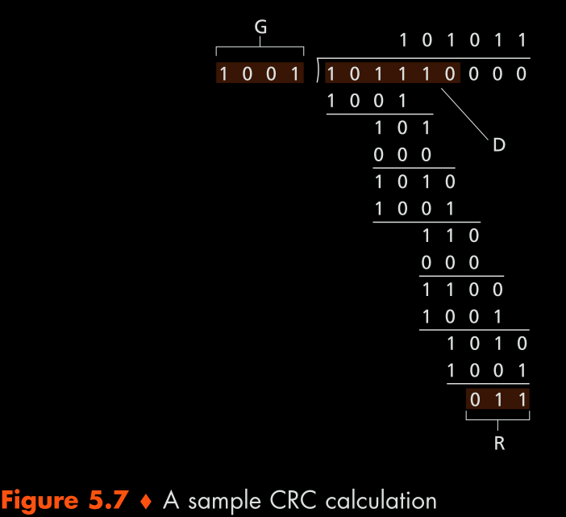

#### 1 Role of Link layer
- Transports network layer packets over the links
- Receives the signals from the physical link and sends it to the network layer

#### 2 Services provided by Link layer
- **Framing**
	- Encapsulate network layer packets in frames
	- Frame format is specified by the link layer protocol
- **Link access**
	- Media access control
		- Restrict access of frame only to the destined host
		- This is used so that when hosts are connected to broadcast links, only the destined host receives the frames
- **Error detection and error correction**
- **Reliable delivery**
	- Transfer frame reliably over the link
	- Used in link that are more error prone

#### 3 Link layer implementation
- Interface between hardware link and upper OSI layers
- Most of the implementation is in the network interface card

#### 4 Error detection and error correction
 - Add redundant bits to the data that facilitate to identify and correct errors
 - The following methods are used to generate the error detection bits
##### 4.1 Parity Check
- Single bit Parity 
	- Add 1 parity bit to the data
	- Odd parity
		- Set to 1 if, number of 1 is data is odd
	- Even parity
		- Set to 1 if, number of 1 is data is even
##### 4.2 Check sums
- Check [RFC 1071](https://datatracker.ietf.org/doc/html/rfc1071) for check sum implementations
##### 4.3 CRC
- Given
	- Generator - n bits
	- Data bits - d bits 
- Append n-1 0s to the data
- Divide the data by the generator
	- Each subtraction op in division is just an xor operation
- Append the remainder to the data without the 0
	- The total length after appending will be d+n-1 bits
- At receiver divide the entire message using the generator
	- If the remainder is 0, then no error
- Example 

#### 5 Multiple access control
- **What is multiple access control?** 
	- Select which node can use the link to send the data
	- Needed when multiple nodes are connected to the same physical link
	- When one node sends data over link all nodes connected to the link will receive the data
	- Networks that need multiple access control are wifi and ethernet
- **Methods for multiple access control**
	- **Channel partitioning** 
		- Time division multiplexing
		- Frequency division multiplexing
		- Code division multiple access CDMA
			- Each node is assigned code
			- Node encrypts data using code
			- All nodes can send data simultaneously
			- Used in wireless networks
	- **Random access protocols**
		- Slotted ALOHA 
			- Time slots = Time to transmit one frame
			- Each node can transmit at the start if the time slot 
			- When collision occurs, 
				- Re-transmit frame at next time slot with probability p or 
				- Skip the next time slot
		- ALOHA
			- When frame available, transmit immediately
			- If collision occurs
				- Re-transmit immediately with probability p or 
				- Wait for time t
		- Carrier sense multiple access with collision detection(CSMA/CD)
			- When frame is ready to transmit, send frame if channel is idle
			- if other signals are present during transmission, abort transmission
			- Wait for a random amount of time and re-transmit the frame

#### 6 Link layer addressing
- **MAC Address**
	- Fixed address for an adapter 
	- All adapters have a unique MAC Address 
	- When adapter receives a frame, the frame that has its own mac address will only be sent to the upper layers
	- If a frame has to be sent to all adapters, MAC broadcast address is used
- **ARP**
	- Find MAC address using the IP address
	- Used for link layer addressing in the same sub network 
	- ARP table is maintained at each host and router

#### 7 Link Efficiency/Utilization
- Efficiency = (1+2(Tp/Tt))-1
	- Here 
		- Tp Is the propagation delay
			- Tp = d/v 
			- where d is the link length and 
			- v is the signal speed
		- Tt is the transmission delay
			- Tt = L/R
			- Where L is the length of the packet to transfer
			- R is the transmission rate of the link