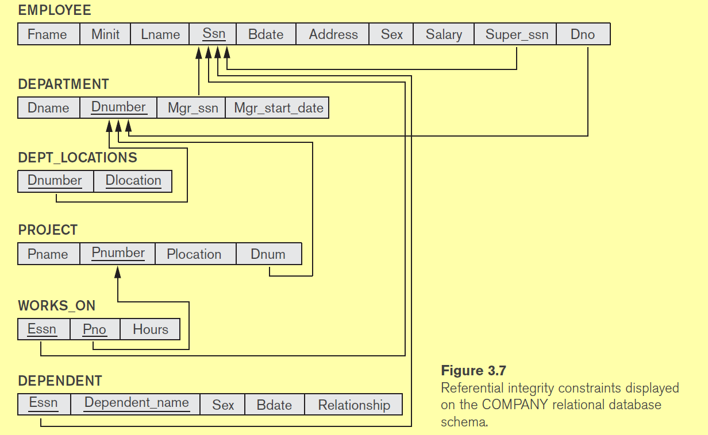

#### 1 Relational data model
- Represents data as a collection of relations
	- Relation is represented as follows
		- R(A1, A2, A3 .... AN)
		- Here R is the name of the relation (example Student, Employee)
		- Ai is an attribute of R
		- The degree or Arity = N (number of attributes)
		- The relation R will contain **set of tuples** t
			- Each tuple will have N values t(u1, u2, ... uN)
			- **Each tuple in the relation must be unique**
				- Mathematically set should not contain duplicates
- Each tuple in a relation is a fact
	- A relation is a collection of facts about an entity or relationship
	- Example
		- STUDENT(name, age, id) represents facts about entity student
		- MAJOR(id, Course) represents facts about the relationship between entity student and Entity Course
- Domain of Attribute
	- Representation
		- Domain of attribute Ai is dom(Ai)
	- What is domain of an attribute?
		- The possible values of Attribute Ai
- Mathematical definition of relation
	- R = dom(A1) X dom(A2) ... dom(AN)
	- X is the cartesian product, represents all combinations of values of Ai
	- Here the cartesian product will not produce any duplicate records, this means a relation cannot have duplicate records
- Cardinality
	- Number of values in a domain
	- Representation
		- |dom(A)|

#### 2 Super Keys, Candidate keys and Primary Key
- **What is Super Key**?
	- SK is the super key which uniquely identifies the tuple
	- It is a set of attribs/attrib that are unique to each tuple
- **What is a candidate key?**
	- Minimal super key is a candidate key
	- **What is minimal super key?**
		- When any attribute is removed from the super key, it cannot identify the relations
		- Super Keys with the above properties are called minimal super keys or candidate keys 
	- Example
		- Relation Student(Name, CollegeID, AadharID)
		- The super keys are 
			- The combination of all the attributes with CollegeID and AadharID
		- Here CollegeID and AadharID are candidate keys
		- One of the candidate key is assigned as the primary key
- **What is a PK (Primary key)?**
	- There can be multiple candidate keys for a relation
	- One of the candidate key is made the PK, which will be used to identify a tuple uniquely

#### 3 Constraints in relational model
- **Key constraints**
	- No two tuples should have the same value for the Super key
- **Integrity constraints**
	- Entity integrity constrains
		- Primary key != NULL
	- Relational integrity constraints
		- Tuple should references another existing tuple
		- **Relational integrity constraint formal def**
			- Consider two relations R1, R2
			- A subset of attributes FK (foreign key) for relation R1, references R2 if
				- dom(FK) = dom(PKR2)
				- There exists a tuple(t1) in R1 such that t1(FK) = t2(PK), where t2 is a tuple in R2
				- Here the Relations R1 and R2 can be same

#### 4 Relational database schema
- Consists of 
	- Set of N relations
- Example schema 

