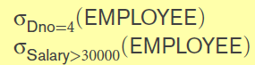

#### Use
- Define operations in data model
	- for querying the database, use tuple calculus
- Basis for implementing and optimizing queries in the query processing and optimization modules
- Perform basic retrieval operation using relational algebra expression
	- **Relational algebra expression**: Sequence of relational algebra operations

#### 1 Relational algebra operations
- Consists of
	- Set operations
		- Union, intersection, set difference, Cartesian product
	- Operations specific to database
		- Unary
			- Select, project
		- Binary
			- Join
			- Set operations

##### 1.1 Unary relational operations 
- **SELECT**
	- Filter tuples in a relation based on a condition (horizontal partition)
	- Representation 
		- 
	- Example: 
		- 
		- Line 1: filter tuples that have Dno attrib as 4
		- Line 2: filter tuples that have Salary attrib greater than 30000
	- Properties
		- Commutative
- **PROJECT** 
	- Filter attributes that are required from a Relation(vertical partition)
	- Representation
		- 
	- Example
		- 
		- Use only attribs: Lname, Fname and Salary
	- Properties
		- Removes duplicate tuples
- **RENAME**  
	- rename relation and/or attribs in relation 
	- Syntax
		- 
		- Expression 1: Rename relation R to S and rename attrib as (B1, B2, .. Bn)
		- Expression 2: Rename relation R to S
		- Expression 3: Rename attrib of R as (B1, B2, .. Bn)

##### 1.2 Binary Set operations (Union compatible)
- Consists of Union, Intersection and set difference operation
- Operation can be performed on two relations only if
	- Both relations have same degree N and
	- For each attribute Ai in R1 where 1<=i<=N 
		- There should be one attribute Bj in R2 such that dom(Ai) = dom(Bj)
- **UNION**
	- Tuples in both relations combined
	- Union removes duplicate values
- **INTERSECTION**
	- tuples in both relations
- **Set difference**
	- R - S, all tuples in R but not in S

##### 1.3 Other Binary Set operation
- Operations that does not need union compatibility
- **Cartesian products (CROSS JOIN)** 
	- R X S will result in a Relation Q with
		- degree Q = degree R + degree S
		- number of tuples in Q = (number of tuples in R)\*(number of tuples in S) 

##### 1.4 Binary Relational operations
- **JOIN**
	- Can be denoted as cartesian product followed by select
	- Representation 
		- Combine all the tuples from DEPRATMENT and EMPLOYEE where the Mgr_ssn = ssn
		- This is same as 
			- TEMP<-DEPARTMENT X EMPLOYEE
			- SigmaDEPARTMENT.Mgr_ssn = EMPLOYEE.Ssn(TEMP)
	- Variations
		- INNER JOIN: The tuples that don't match are eliminated i.e. when join attribs are NULL the tuple will be eliminated
			- JOIN: by default eliminates tuples with null value in join attibutes 
			- EQUIJOIN: Join with equality operator
			- NATURAL JOIN: Join based on the attribs that have the same name in both relations
				- Represented by \* operator
		- OUTER JOIN
			- LEFT OUTER JOIN
				- All tuples from the first relation is preserved
			- RIGHT OUTER JOIN
				- All tuples from the second relation is preserved
				- 
			- FULL OUTER JOIN
				- All tuples from both relations are preserved
	- Join sensitivity
		- (number of tuples after join) divided by (maximum number of tuples after join)  

##### 1.5 Complete set of relational algebra operations
- A operation set is complete if
	- All the other operations that are not in the set can be performed by a sequence of operation from the set
- The following are some examples of complete sets
	- NAND
	- NOR
	- {AND, NOT} -> same as NAND
	- {NOT, OR} -> same as NOR 

##### 1.6 DIVISION operation
- T <- R / S
- Applied when attributes of S is a subset of attributes of R
- Let attributes of R be set X and attributes of S be set Y
- The result T will have the attributes set X-Y
- The result will have a tuple ti(X-Y) from R if
	- ti(X-Y) appears for all the tuples in S
- Example: T <- R / S 
	- 
	- The result has the values of B, that are present for all the values of attribute A in S

##### 1.7 Aggregate operation and Grouping
- SUM, AVG, MIN, MAX, COUNT
- Representation: 
	- Symbol Script F  
- Example 
	- Display the number of employees and average salary for each department

##### 1.8 OUTER UNION
- Performed when tuples are partially compatible
- Outer join on Relation R and S
	- Same as Full outer join on Relation R and S based on common attributes of R and S