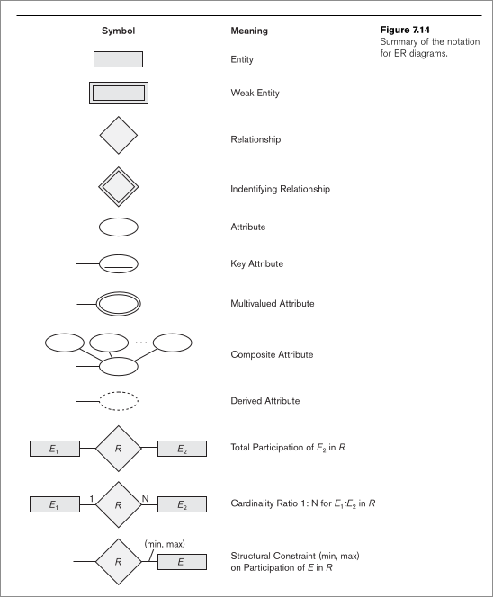

##### Introduction

- **What is a ER model?**
	- High level data model
- **What is the use of an ER Model?**
	- Used for conceptual design of database application
- **What does the ER Model contain?**
	- The ER Model contains
		- Entities
		- Entity attributes
			- **What are the characteristics of attributes?**
				- Single or Composite
				- Single valued or Multi valued
				- Stored or derived 
		- Relations

##### Relations
- **What are relations?**
	- Relate two or more entities
	- Relation can occur between the same entity
- **What does a relation consist of?** 
	- Name of relation
	- Carnality number (one to one, many to one, many to many)
	- Role name
		- Assigned for each entity participating in the relation
	- Full participation 
		- Represented by double lines in ER diag
		- All the instances in the entity participate in the relation
- **What is a degree of a relation**?
	- Number of entities participating in the relation

#### ER diagram
- Diagrammatic representation of ER model
- Notations in the ER Diagram: 
