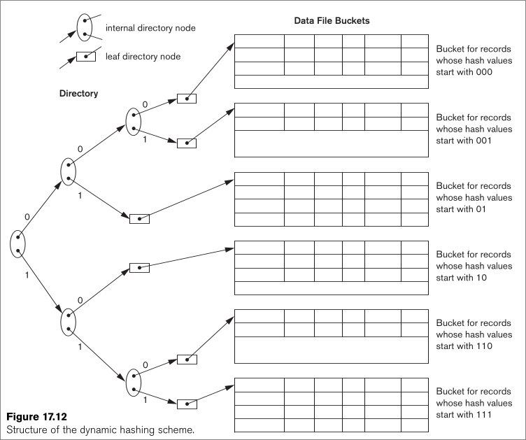

#### 1 Physical organization of the database
- **How is the data stored in the physical medium?**
	- Stored as files of records
	- The data can be accessed differently based on how it is stored
- **What are Files?**
	- Sequence of records
	- File also contains headers
		- Record format
		- Separator info
		- Unspanned or spanned organization
	- Typically the records of a file have the same record format
- **What are records?** 
	- Collection of values, represented as bytes, that describes an entity and its attribs
	- Each value of field describes an entity's attrib
	- Record format/ Record Type
		- Field name and the data type
- **Types of records**
	- Fixed length: records of the same file have the same length 
	- Variable length: records of the same file have different length
- **How to get fields from a stream of bytes?**
	- Each field and value has a separator
	- Each field and value pair will have another separator
	- A record end will have a special separator
	- This is not necessary for fixed length records because the size is already known

#### 2 Storing the File on a block
- **What is a Block?**
	- Block is the unit of transfer for the storage medium
- Files are stored in a block
	- The number of records per block is called the blocking factor
	- Blocking factor = floor(block size/record size)
- If block size is not an integral multiple of record size
	- Unused space is present in the block
		- Unspanned organization: Unused space is not utilized
		- Spanned organization: Unused space is utilized for storing a part of the record. A record can be in two different block in this organization

#### 3 Organising records in a file
- Heap
	- Unordered records
	- Store the records as they are inserted
- Ordered records
	- Ordering is done based on a ordering field
- Hashing

##### 3.1 Hashing
- Stored based on the hash field
- Constant time access of equality conditions on hash field
- Searching
	- Internal: search content that is loaded in main memory
	- external: search content that is stored in the secondary memory
- **Internal Hashing**
	- Use an array of records
	- Hash key: field value 
	- Hash value will be the array index
- **External Hashing**
	- Hash key: field value
	- Hash value: Bucket number
	- **What is a bucket?**
		- One or more contiguous disk blocks that can store multiple records
		- Each bucket is numbered uniquely
	- **How to get the physical address of bucket using the bucket number?** 
		- A mapping is stored in the file header where the bucket number is mapped to its corresponding physical address
	- **How many buckets are present?**
		- Static hashing: constant
		- Dynamic Hashing or Extensible hashing: variable
- **Extensible hashing**
	- Directory: Array containing of size 2d -> 2d bucket addresses 
	- Hash key: first d bits of the field value
	- Hash value: index in directory, the contents of the directory is the physical address  
	- Each bucket has a size of d'
	- if d' = d and collision occurs, increase the size of array by d+1 -> doubling the array 
	- Basic concept
		- When you have two records with different first bit, one bit is enough to distinguish between them
		- When there is a third record, the second bit of the records is also required assuming that all three records have three different starting bits 
- **Dynamic Hashing**
	- Similar to extensible hashing but has a tree structured directory 

##### 3.2 Indexing
- Used to index files
- For example 
	- To find a records with a particular value, the DB engine needs to know in which physical block the file containing the record is stored
	- The naive approach is to load each block one by one to search for the record, this is slow
	- The other approach is to maintain the files in an index, the index will associate a search key with the record and corresponding physical address  
		- The records in the file can be organised based on hash or sort key