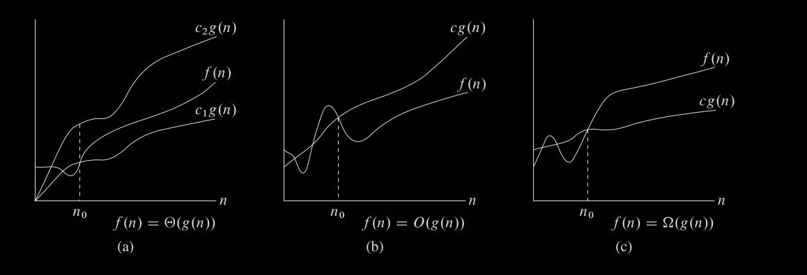

#### 1 What is asymptotic notation?
- Used to represent the increase in time of an algorithm with the increase in input size

##### 1.1 Theta notation, Big O and Big Omega notations

##### 1.2 Small o, small omega notations
- Small o notation
	- Used when when the function is not asymptotically tight 
	- n belongs to o(n2)
	- n2 does not belong to o(n2)
- Small omega notations
	- ω notation to denote a lower bound that is not asymptotically tight
	- n2/2 belongs to ω(n)
	- n2/2 does not belong to ω(n2)
