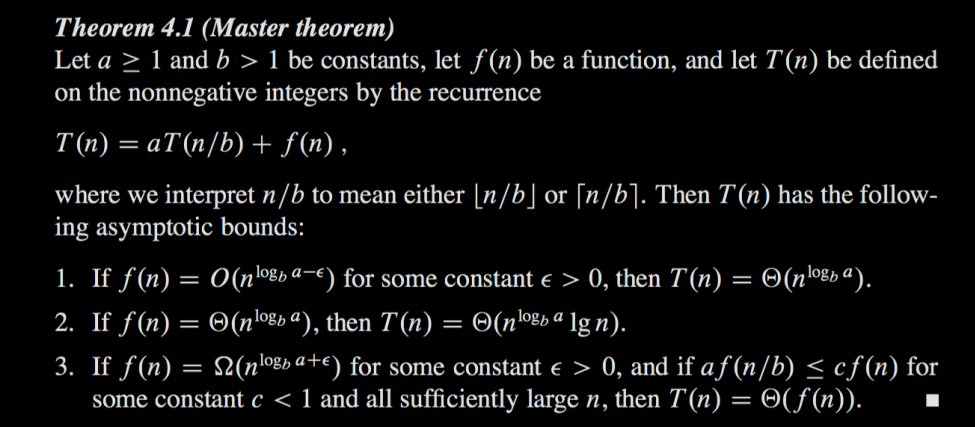

#### 1. What are recurrence relations?
- Used to determine the run time of programs using recurrence
- Example recurrence relation
	- T(n) = T(n -1) + 1, T(0) = 1

#### 2. How to solve a recurrence relation
- **Iterative method**
	- Expand the recurrence relation to find a pattern
		- T(n) = T(n-1) + 1
			- Substitute  T(n-1) = T(n-2) + 1
		- T(n) = T(n-2) + 2
			- Substitute T(n-2) = T(n-3) + 1
		- T(n) = T(n-3) +3
			- Substitute the number with k
		- T(n) = T(n-k) + k
			- When k = n, T(n-k) = T(0) = 1
		- T(n) = n + 1
	- This means the function using this recurrence relation belongs to O(n)
- **Master's theorem** 
