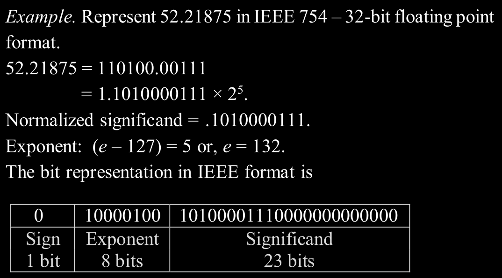

### Representing numbers
- Binary - Integers 
	- Signed Magnitude
		- Most significant bit is the sign bit
	- 1's complement 
		- Subtract +ve signed magnitude number from (2^n - 1)
		- n -> total number of bits including sign bit
	- 2's complement
		- Subtract +ve signed magnitude number from 2^n
		- or add 1 to 1's complement
	- **Need for other representation**
		- 2's complement can be used for efficient arithmetic operations
- **Floating point numbers**
	- Representation: use scientific notation with
		- Sign for the number
		- Significant digits
		- Signed power

**Floating point number representation and operations** 
- Reference: [IEEE 754 Floating point representation](./Attachments/PDFs/floating_point_representation.pdf)
- Floating point representation using 32 bit integers 
	- Sign bit - 1 bit
		- 0 if positive
		- 1 if negative
	- Exponent - 8 bits
		- Bias 127
		- Exponent range = -127 to 128
	- Significant - 23 bits
	- 
- The number represented by the above representation is 
	- Here f is the significand 
	- 1 is always takes as the MSB
	- Exponent is the number represented by 8 bits
		- The exponent range is -127 to 128 
		- The exponent bias is 127
			- This means all the effective value will be obtained by subtracting 127
- Converting float to binary example 
	- Converting 52.21875 to binary
		- Integer part is converted by the normal method 
		- For the fraction part multiply the fraction by 2 continuously
			- 0.21875\*2 = 0.4375
				- Add the MSB to the ans and use the fraction part for next step
				- Binary = 0
			- 0.4375\*2 = 0.875
				- Binary = 00
			- 0.875\*2 = 1.75
				- Binary = 001
			- 0.75\*2 = 1.5
				- Binary = 0011
			- 0.5\*2 = 1.0
				- Binary = 00111
- Representing 0
	- All the Exponent and Significand bits are zero