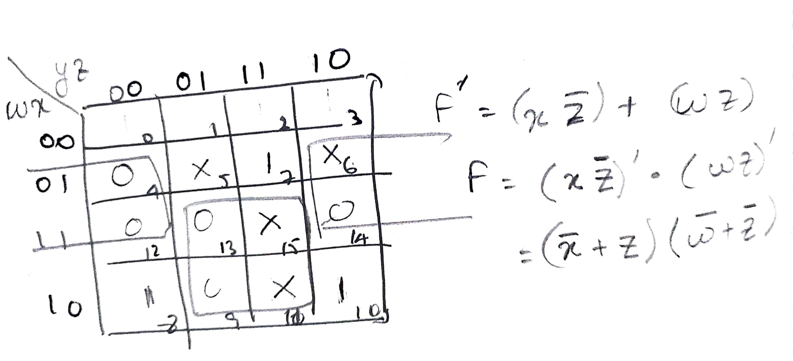

#### 1 Gates and Boolean expressions
- All information in computers are stored and manipulated in binary from
- The gates manipulate these binary information
	- Truth Table: represents the I/O of a gate
	- Boolean Expression: simplified from of the truth table
- Basic Gates

![[logical_gates.jpg]]

- The following image represents the boolean Identities
	- These can be used to simplify complex boolean expressions

![[boolean_identities.png]]

#### 2 Simplifying the boolean expression using K map
- We need gates to perform any boolean  expression 
- to use lesser gates we need to simplify the expression
- The map provides the procedure to simplify a boolean exp

##### 3 Definitions and representation
- **Boolean Operations** 
	- For additional Boolean Operations refer: [Boolean Ops](https://en.wikipedia.org/wiki/Boolean_algebra#Operations)
	- For Boolean operation laws refer: [Boolean ops laws](https://en.wikipedia.org/wiki/Boolean_algebra#Laws)
- **Variable**
	- A variable can take a value of 0 or 1
	- Example: 
		- F(A,B,C) has three variables
- **Literal**
	- A literal is the use of a variable or its complement in an expression
	- F(w,x,y,z) = xy + x'y' + wz
		- There are 6 literals: w, x, y, z, x', y'
		- **There are three terms**: xy, x'y' and wz
- **Min-term**
	- A combination of variable in the truth table
	- If a boolean expression has 2 variables {A, B}, then the min terms in the truth table are AB, AB', A'B, A'B' 
- **Number of entries in the truth table/Number of min-terms in truth table**
	- If a boolean expression has n variables, then the number of entries will be 2^n if each variable can take a value of 0 or 1
- **Simplified representation of boolean expression**
	- Min-terms that give a result of 1 in the truth table can be used to represent the truth table
	- For example consider the following truth table
		![[truth_table_1.png]]
	- The min-terms the produce the result one are {001, 100, 101, 110, 111}, these are binary combination, by converting it to decimal we get {1,4,5,6,7}
	- The simplified representation of the truth table will be
		![[truth_table_1_simplified_representation.png]]
	- Max term representation: #TODO 

##### 4 K-Map method
- **STEP 1**: Draw a grid with 2^n squares, the row represents floor(n/2) min-terms and the column represents ceil(n/2) min-terms (A grid shaped truth table instead of a list)
	- For example if there are three variables {A,B,C}, the row will have A and column will represent the binary combinations of BC
		![[truth_table_1_k_map_represrntation.png]]
	- **Notice that the adjacent binary combination vary by one bit** i.e. for BC the combination is 00, 01, 11, 10 and **not** 00, **01, 10**, 11 
- **STEP 2**: Mark one in the squares of the min-terms that give the result 1
	- Example:
		![[truth_table_1_k_map.jpg]]
- **STEP 4**: Group the adjacent squares that are marked with 1 based on the following rules
	- For the squares in one edge, the squares in other edge are considered as adjacent (similar to circular linked list)
	- All the four corners are considered to be adjacent
	- When grouping x number of squares, x should be an integral power of 2
	- When grouping, a square can be a part of multiple groups
	- Example: 
		![[truth_table_1_k_map_groups.jpg]]
- **STEP 5**: Write the simplified expression. The simplified expression will be the sum of boolean expression for each group
	- Example: 
		![[truth_table_1_simplified_boolean_exp.jpg]]

##### 5 Product of sum representation
- Grouping 1s in K-map will give sum of products representation of F
- Product of sum representation
	- Group 0s in k-map with the same rules of how 1 s are grouped
	- The resulting sum of product expression represents F'
	- Complement of this result will give the product of sum representation
	- Example: 
- **How to find the product of sum representation?**
	- Boolean expression F(A,B,C) = Σ(1,4,5,6,7)
	- The sum of product representation
		- F(A,B,C) = A'B'C + AB'C' + AB'C + ABC' + ABC
	- The sum of product representation of F'(A,B,C) = Σ(0,2,3)
		- F'(A,B,C) = A'B'C' + A'BC' + A'BC
		- Take complement on both sides
			- F(A,B,C) = (A'B'C' + A'BC' + A'BC)'
				- Apply DeMorgan's law on RHS
			- The product of sum representation is
				- F(A,B,C) = (A+B+C)(A+B'+C)(A+B'+C')

#### 6 Don't care conditions in K-map
- What are don't care conditions
	- The result produced from some min-terms are not used. These min-terms from the don't care condition
- How to find the don't care conditions
	- Don't care conditions will be explicitly mentioned
- How does it affect K-map simplification
	- For such min-terms, fill X in the K-map
	- The X can either be 0 or 1 in order to get the simplified boolean expression

##### 7 Complete set of boolean algebra operations
- A operation set is complete if
	- All the other operations that are not in the set can be performed by a sequence of operation from the set
- The following are some examples of complete sets
	- NAND
	- NOR
	- {AND, NOT} -> same as NAND
	- {NOT, OR} -> same as NOR 

#### 8 Implicants and Prime implicants
- Reference: [K-map implicants](https://www.geeksforgeeks.org/various-implicants-in-k-map/)
- [Example Question](https://gateoverflow.in/204124/gate-cse-2018-question-49#a_list) 

