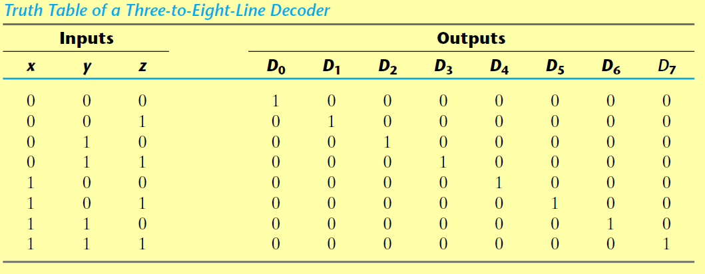
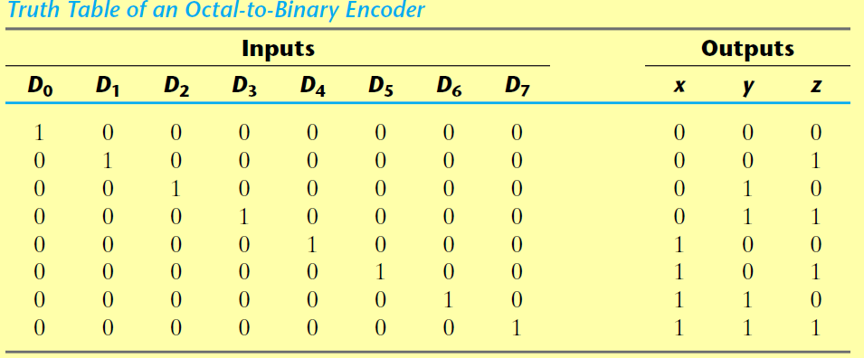
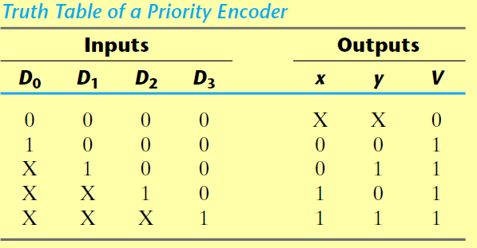
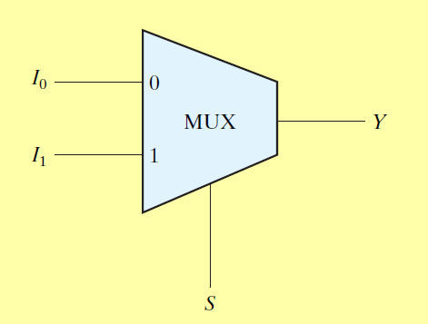
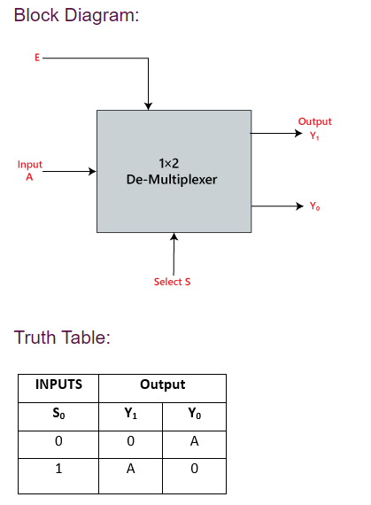

#### 1. Decoders
- Purpose
	- Converts n bits to 2n bits
	- Example for converting 3 input lines to 8 output lines
- Input
	- n bits
- Output
	- 2n bits, only one bit will be set to one for an input

#### 2. Encoders
- Purpose
	- Converts 2n input lines to n output lines (opposite of Decoders)
	- Example truth table 
- Input
	- 2n bits
- Output
	- Output corresponding the input (if d7 is active, output will be 111)
- Drawback
	- if two inputs are active at a time, invalid result is obtained

#### 3. Priority Encoders
- Purpose
	- Encoder that encodes only higher data signals
	- Example, if D0 and D1 is active, the result will correspond to D1 output
- Example Truth table 
- Input
	- 2n bits, only one bit will be set to one for an input
- Output
	- n+1 bits
	- V bit represents if valid input is present. if all inputs are 0, v will be 0

#### 4. Multiplexer
- Purpose
	- Data selector, select input from many lines and output it to one line
- Example
	- Two to one multiplexer
		- Selects from 2 input lines and one line to select from the input line
		- Block diagram of multiplexer 
		- If input 
			- S = 0, output Y = I0
			- S = 1, output Y = I1

#### 5. De-mux
- Input
	- n Select
	- 1 input
- Output 
	- 2n outputs where one line will be equal to the input
- Example 1 to 2 de-mux  

#### 6. Full adder [3](References.md)
- Truth Table
	- S indicates Sum
	- C indicates Carry
	
	

#### 7 Ripple carry adder
- Ripple adder question: [ref](https://gateoverflow.in/8250/gate-cse-2015-set-2-question-48#a_list)
- Ripple adder and carry look ahead adder: [ref](https://www.ece.uvic.ca/~fayez/courses/ceng465/lab_465/project1/adders.pdf)

#### 8 PLA
#TODO 