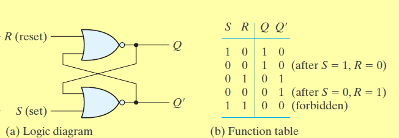
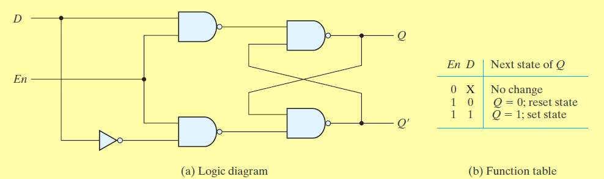
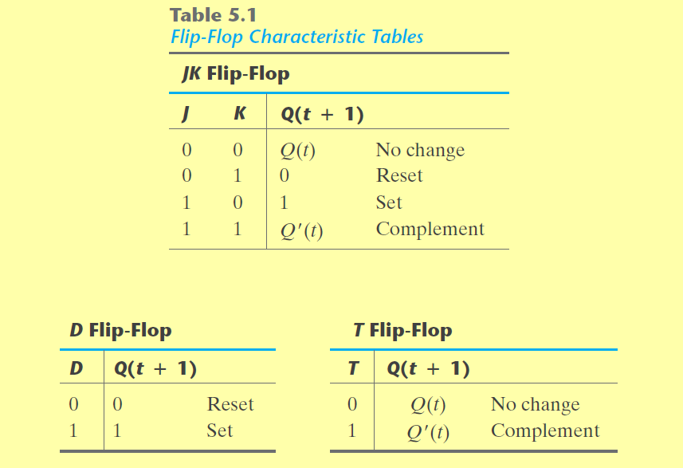
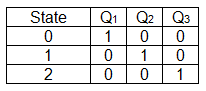
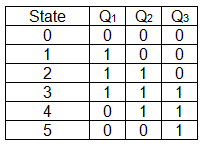

#### 1. What it is?
- Present Output of circuit depends on past output and previous output
- Types
	- Synchronous
		- Has a clock, only when clock is active the circuit computes the output
	- Async
		- No clock, the circuit is also affected by the order of which the input changes
- A sequential circuit can be split into 
	- A combinational circuit with inputs as 
		- Current output of circuit depends on past output and current input
		- The previous output is stored in a storage element
	- Storage elements
		- The storage element can can be Synchronous or async
			- Latches are async and are level sensitive
			- Flip-flops are sync and edge sensitive

### 2. Storage Elements
#### 2.1. SR Latch
- Inputs
	- S, R
	- Q and Q', previous outputs
- Output 
	- Q, Q'
	- If Q = 1 and Q' = 0, latch is in set state (S is changes to 1 and back to 0)
	- If Q = 0 and Q' = 1, latch is in reset state (R is changed to 1 and back to 0)
- Circuit Diagram               

#### 2.2. D Latch
- Inputs
	- D  = {0, 1}
	- EN = {0, 1}, Enable
- Output
	- Q, Q' remains same if EN = 0
	- Q = 1, if D = 1 &&  EN = 1
	- Q = 0, if D = 0 && EN = 1 
- Special case of SR latch where R = S'
- Circuit diagram  
#### 2.3 D Flip Flops
- Same function of a latch, but it is edge triggered
- Types: 

#### 2.4. Ring Counter
- Analogous to stepping switch 
- For a N bit ring counter
	- 1st clk cycle: first bit = 1, other bits = 0
	- 2nd clk cycle: second bit = 1, other bits = 0
	- 3rd clk cycle: third bit = 1, other bits = 0
	- Nth clk cycle: Nth bit = 1, other bits = 0
	- repeat sequence
- Example truth table   
- If there are n states, n flip flops are required

#### 2.5. Johnson Counter
 - Example truth table for a 3 bit Johnson counter  

#### 2.6. Counters
- Design circuit using flip flops based on counter sequence
- Steps: (NOT TESTED FOR ALL CASES)
	- Check the number of states
	- Consider each flip flop as a bit
	- Find the number of bits required to represent all states
	- The number of flip flops will be equal to the number of bits 
