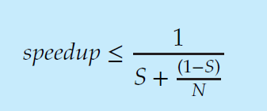

#### 1 What is a process
- Program in execution

##### 1.1 Process states

- **Process States**
	a. New
	b. Running
	c. Waiting - For IO
	d. Ready - Waiting for CPU
	e. Terminated

- **How is a process state represented by the OS**
	- Using Process Control Block(PCB)
		- What is the PCB and where is it stored
			- #TODO-Extras 
		- What does the PCB contain
			- Contains the info that are present in the stack frame 
				- For more detailed explanation of stack frame: [[2.2 Computer Organization - RISC#Subroutines |Subroutines and stack frame]]
			- Scheduling info - priority
			- Memory management info - page tables or segment tables
			- Accounting info
			- I/O status - resources allocated, file locks

##### 1.2 CPU Scheduling 

- Create a schedule that allocates CPU to processes
	- AIM: high CPU utilization, Low starvation

- **Context Switching**
	- Stop current process exec
	- Resume exec of another process 

##### 1.3 Operations on a process

- **Process Creation**
	- **Tracking all processes**
		- Parent process creates child process
		- Parent child process are stored in the form of a tree
			- If the processes parents are stored in a tree, in which memory is this DS stored in?
				- #TODO-Extras 
		- Root of process tree will be system process
			 - systemd
				- One of the programs that is used to start all the processes in Linux
				- Learn about systemd #TODO-Extras 
	- **Resources**
		- The child process can get resources for OS or the parent process
		- Resource hogging is minimized by restricting the child process to use parent process resources
	- **Execution**
		- Parent and child executes concurrently
		- Parent waits for child execution
	- **Program data**
		- Parent and child has same program and data
		- Child has a different program

- **Process Termination**
	- Using exit()
		- Occurs when process calls exit()
		- Child process can return a value to parent that is using wait()
		- All the process resources are deallocated
	- Terminate process
		- A process terminates another process
		- The parent can terminate the child process
		- Or Parent process can be terminated, which leads to child process termination

##### 1.4 IPC

- **What is IPC?**
	- Inter Process Communication

- **How?**
	- **Approach 1: Shared memory**
		- Characteristics
			- Faster
			- Process should be in the same system
		- How
			- One process creates a shared memory in its own address space
			- Another process agrees on the shared memory (OS will allow the process to access the shared space) 
			- Read or write in the shared memory
	- **Approach 2: Message passing**
		- Characteristics
			- Slower
			- Can be used in distributed systems
			- Can be direct or indirect
			- Can be synchronous or Async
		- How
			- Create mail box
			- Send and receive messages from the mail box
			- Mail box can be owned by process or the OS

##### 1.5 Amdahl's Law
- Calculate the performance gain when more cores are added 
- Formula
	- S -> % of job that is performed serially
	- N -> number of Cores

##### 1.6 Definitions
1. Task Parallelism
	1. On the same data, two different tasks are performed parallelly
	2. Example: Calculating the mean and median on a series of numbers
2. Data Parallelism
	1. The data is distributed among threads to perform single task faster
	2. Example: Similar to map reduce. Calculate the sum of all the numbers, one thread will calculate the sum of a subset of numbers
3. Multiprogramming
	1. Run multiple programs
	2. In a single core processor, when one process is waiting for IO, the CPU executes another task instead of waiting ideally
4. Multiprocessor
	1. More number of cores to execute processes parallelly