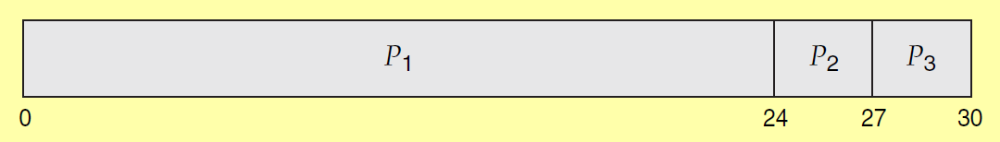

### 1 What?
- Schedule the resources for the kernel thread
	- Decide which kernel thread gets the CPU for execution 
		- CPU is just one of the resource
		- Other resources also needs to be scheduled
			- What are the other resources and how is it scheduled? 
				- #TODO-Extras 
	- Who does the scheduling?
		- Scheduler
			- This program is a part of the OS
- Aim of scheduler?
	- maximize the resource utilization 
	- minimize the process waiting time

### 2 Definitions
- Preemptive Scheduling
	- When CPU is executing an instruction of Process P1, 
	- If another process P2 of higher priority raises an interrupt, the CPU will switch to P2
- Non Preemptive Scheduling
	- When CPU is busy, the interrupts from other processes are ignored
- Critical section
	- Sections of code that edit shared data is called critical section
	- To prevent two processes to edit the shared data, critical section can be accessed by only once process(mutual exclusion)
		- How is mutual exclusion preserved?
			- Using methods described in [[3.1 Process Synchronization]]
- CPU Scheduler
	- Decides which thread is allocated the CPU
		- The CPU is not allocated by the scheduler 
		- Only a thread is chosen by the scheduler, CPU allocation is done by dispatcher 
	- The scheduler runs only when the following events occur 
		- a process terminates
		- a process switches to wait state from run state
		- a process switches to wait state from ready state
		- a process switches to ready state from run state (Can happen when an interrupt occurs, the interrupted process will switch from run to ready state)
- Dispatcher
	- Responsible for the context switch
		- Context Switch
			- Store all the general purpose register 
			- Store  current value of Program counter
			- Load the values for relocation register and limit register (used by MMU [[4.1 Memory Organization]])
	- Allocates the CPU to the process
	- **Dispatch latency**: The time it takes for the dispatcher to stop one process and start another process
- Burst Time
	- CPU time required by the process to complete its task
- Wait time
	- Time elapsed between the process switching from ready state to run state
- Turn around time
	- Total time for process to finish, including the waiting time and burst time
- Gantt Chart
	- Diagram used to depict which process gets the CPU
	- Example chart: 
		- Represents the CPU time for each process P1, P2 and P3 
- Process Contention Scope
	- Which user thread is allotted a kernel thread
	- This is managed by the thread library
	- Priorities to user threads are set by programmer 
- System Contention Scope
	- Which kernel thread gets the CPU
	- OS decides which kernel thread gets the CPU

#### 3 Scheduling Algos
1. **FCFS**
	1. Non preemptive
2. **SJF**
	1. Shortest Job first
	2. Can be preemptive or non preemptive
	3. Preemptive: choice has to be made when CPU is busy and a new process arrives
		1. Also called as Shortest Remaining Time First(**SRTF**) scheduling
3.  **Round robin**
	1. Allot CPU time slice for each process
	2. Preemptive by nature
4. **Priority Scheduling**
	1. Allot CPU to highest priority task. 
		1. Lower number will have higher priority
	2. Can be preemptive or non preemptive
	3. Can Cause starvation in high p task has large burst time
		1. To solve this issue, low priority tasks increase its priority based on aging(wait time)
	4. Searching a process will take O(N) time, N is the number of process that is in ready state
5. **Multilevel queue Scheduling**
	1. More than one ready queue unlike other algos
		1. Each queue has a priority
	2. Queue with higher priority will be executed first
		1. This can also cause starvation for processes in low p queue
6. **Multilevel feedback queue**
	1. To prevent starvation in multilevel queue, aging is used
		1. Aging can also be used here, if process waiting time is high, the process can move to high p queue from low p queue
	2. A process can move between the queues

#TODO-Extras: Learn about Scheduling used in linux: Completely fair scheduler

#### 4 Which is the most efficient
- What is efficiency?
	- minimize response time
	- Maximize throughput (number of process completer per unit time)
- In terms of throughput
	- SRT > SJF > RR

#### 5 Issues in priority scheduling
##### 5.1 Priority inversion
- Problem
	- Lets say there are three processes p1, p2, p3 in decreasing order of priority
	- p1 and p3 requires the same resource
	- When p3 is executing, p2 arrives and stops p3
	- p3 hold the resource that p1 needs
	- When p1 arrives, it cannot execute because p3 has the resource it needs
- To resolve this issue we can use **priority inheritance**
	- Both process and resources have a priority
	- The priority of a resource is the sum of priority of processes that are requesting that resource
	- The priority of the process holding that process will be incremented by the priority of the resource

