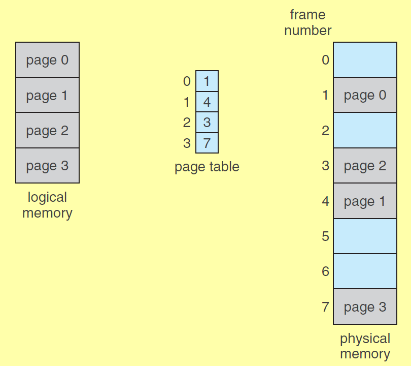
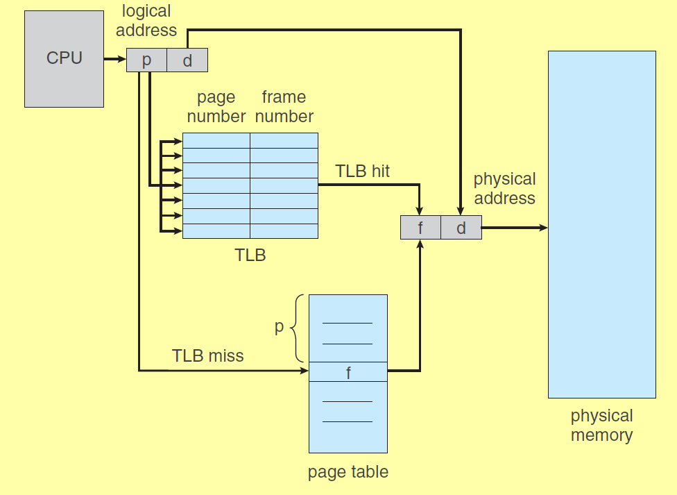

#### 1 Paging
- Noncontiguous memory allocation
- The physical memory is split into fixed size blocks
	- Block is the smallest unit of memory
		- a block is a collection of bytes
		- A block is also called as frame in main memory
		- A block in cache is cache line or cache block
- The logical memory is split into pages
	- Each page occupies one frame in the main memory
- Address generated by CPU contains
	- Page number and page offset 
	- Page number is used to index the page in page table
	- The page table consists of the base address(relocation address)
- Page table\ 
	- Each process has a page table
	- the page table is stored in a contiguous manner in the main memory 
- Frame table
	- Systemwide table controlled by OS
	- This contains the info of the frames that are 
		- free
		- allotted
			- It contains the processes that the frame is allotted

#### 2 Context switches with paging
- Context switches are expensive when paging is used
	- The page table is a set of registers
		- Getting the frame number of a page number is fast
		- This is not feasible for large page table
		- The context switch is expensive as all registers needs to be loaded with different value
	- The page table is stored
		- Getting the page number from the page table takes 2 clock cycle
			- One for accessing the page table in main mem
			- One for fetching the data from the address 
	- Transition look-aside buffer (TLB)
		- Associative memory
		- When page number is given
			- All the locations are searched in parallel
			- the frame number matching the page number is returned
		- The TLB is small
			- does not eliminate the need of page table in main mem
			- Contains only a few of the page table entries

#### 3 TLB
- When CPU generates the logical address
	- MMU checks if the page num is present in TLP
		- If present
			- return the frame number of physical address calculation
		- If not present
			- fetch the frame number from the main memory
			- Add it to the TLB
			- If TLB is full replace an entry
				- Some entries cannot be replace(wired down)
- Context switches
	- The entire TLB is flashed or
	- The TLB stores ASID(Address space identifier) for each TLB entry
		- The ASID is unique to each process
		- When logical address is give to MMU
		- MMU checks the TLB for the page number in the TLB
		- If the ASID of the requesting process 
			- Same as the ASID in TLB
				- Use the frame number for physical address calc
			- Different from the ASID in TLB
				- TLB miss, use main mem for frame number
				- Add new entry to TLB
- Address resolution with TLB 

#### 4 Memory access with page table and cache
- Two steps
	- Computing the physical address
	- fetching data from memory
- **Step 1 (Computing physical address)**
	- Logical address is 32 bits
		- 232 Bytes of logical memory
	- Page size 4 KB (212 Bytes)
		- Number of pages = total mem / page size = 220 pages
	- Logical address has
		- 20 bits for the page number 
			- because there is 220 pages
		- 12 bits as page offset 
			- because page size is 4 KB
	- Searching for frame number
		- Find the page number in TLB using associative search
			- If there is a matching page number
				- return the frame number
		- If there is no matching page number in TLB 
		- Search the page table for the page number
			- If the page table has the page number, return the frame number
			- Else page fault occurs: The page is not present in main memory or cache
				- Trap occurs
				- The register contents are save
				- The OS gets the logical address
				- The OS checks for a free frame
				- If no free frame, replacement algo selects a frame
				- The frame is written back to disk if the frame was modified
				- OS performs the necessary commands to 
					- loads the block that contains the page, to main memory from the disk
					- **How does the OS know where this page resides on disk?**
						- #TODO-Extras
						- Reference links: 
							- [Stack Exchange explanation](https://superuser.com/questions/1296659/how-does-windows-os-keep-track-of-a-processes-virtual-memory#:~:text=The%20gist%20of%20it%20is,or%2C%20if%20the%20page%20table)
					- Once the data is loaded for disk,
					- The page table is updated with the frame number
					- OS returns to the caller, the instruction that caused page miss is executed again
- **Step 2 (fetching the data from memory)**
	- Using the physical address
		- Search the cache using the [[5.2 Cache]] mapping scheme
		- If cache hit
			- return the byte requested
		- If cache miss
			- Search in main memory for the block
			- Move the block to the cache
				- If cache is full
					- Use replacement algo to select a block
					- If
						- write through: no need to write the block to main memory
						- write back: write the block to main memory if it is dirty
				- Move the required block from main memory to cache and return the data requested

#### 5 Page table Structure
- How is the page table implemented
	- Hierarchical
	- Hashed
	- Inverted

##### 5.1 Hierarchical Page table
- When the address space is large
	- The number of entries in the page table increases
	- More entries requires more space in physical memory
	- Allocating a large amount of contiguous memory is difficult
- Aim
	- Split page table so that it is not in contiguous mem locations
- How is the page table split?
	- There are multiple levels of page table
	- Example 2 levels
		- One outer page table
			- This will point to the frame containing another page table
			- The size of this outer page table should be less than or equal to 1 frame. **Why?**
				- Only if the outer page table size id within 1 frame, the n MSB of the logical address can identify a memory location without any offset bits
					- Reference: [Video explaining multi level paging](https://www.youtube.com/watch?v=PiEq1CoP0ds) 
		- One inner page table
			- This will point to the frame number in physical memory
- Example
	- Given
		- Logical address space 4GB
		- Physical address space is 256 MB
		- Frame size/Page size = 4KB
	- \#bits for logical address
		-  ((4 \* 210 MB )\*210 KB)\*210B = 32 bits
	- \#bits for physical address
		- (28 \* 210 KB)\*210 B = 28 bits
	- \#bits for the page offset/frame offset
		- page size is 4KB => 12 bits offset
	- \#bits for frame number
		- \# total bits for physical address - \#bits for offset
		- 28 - 12 = 16bits
	- Page table entry size
		- page table entry will contain a frame number
		- from previous step frame number requires 16 bits = 2 Bytes
		- The page table entry will be 2 B
	- With single level paging
		- \#pages will be = Size of logical address space/size of page = 232/212 = 220
		- Space required for page table
			- number of pages = 220 => number of entries in page table is 220
			- Each entry in page table is 2 B => total size will be 221B
			- In this case the page table should be allocated 2MB contiguous memory
			- This is equivalent to 29 frames, allocating this many contiguous frames for each process will fill the memory, therefore use another page table level
		- The logical address will be split into to two parts
			- 12 bits for offset
			- 20 bits for the page number
	- With two level paging
		- \#pages in level 2
			- \# pages in level 1/ \#entries per page
				- \#entries per page = page size/one entry size = 4KB/2B = 211
				- \# pages in level 1 = 220 (calculated in previous step)
			- 220 / 211 = 29 entries
		- Logical address will be
			- 9 bit for outer page table
			- 11 bits for inner page table
			- 12 bits for page offset
		- Searching
			- The first 9 bits of the logical address is used to find an entry in outer page table
				- The address in the outer page table will hold a frame number of a page
			- Now using the frame number, from previous step
				- access the entry using the 11 bits
				- This entry will have the frame number for the data requested by processor

##### 5.2 Hashed paging
- Hash key will be the page number
- Hash value will  
	- Contain the page number
	- The frame number of the corresponding page number
	- The next value (strategy to handle collisions if two page numbers have same hash)

##### 5.2 Inverted Page Table
- All processes use the same inverted page table which is of fixed size
	- Number of will be always be equal to the number of frames in main memory  
- Each physical frame will have only one entry in page table
	- Each physical frame will be mapped to a process and a page number
	- The page table will be ordered by Frame number
		- the first entry in the table will be for frame 1
		- the second entry in the table will be for frame 2 and so on
- When the processor sends a logical address
	- The inverted page table entry is searched one by one
	- Once when the page numbers match after i searches
		- The frame number will be i
- Advantage
	- Reduced page table size
- Drawback
	- Search takes linear time and not constant time
	- This page table does not allow shared frames
		- One frame can be allotted to two pages of different processes in other types of page tables

#### 6 Pages with different sizes
- #TODO 
