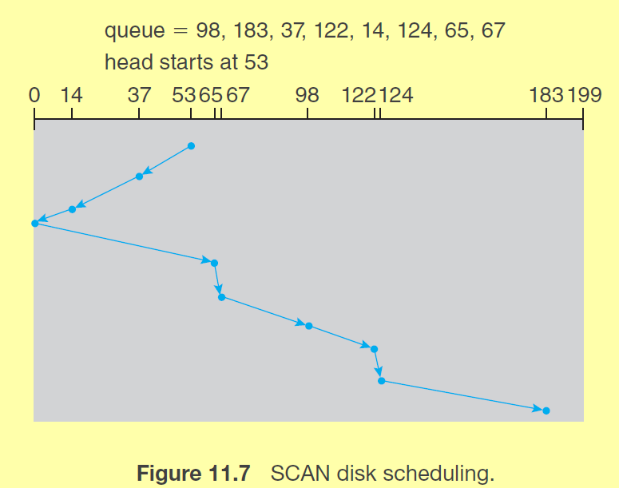

#### 1 Hard disk drives(HDD)
- Internal structure: 
- Platter
	- Disk that rotates
- Track
	- Each platter is made of multiple concentric tracks
- Sector
	- Each track is divided into multiple sectors
	- Sector is the smallest unit if transfer
	- Contains 
		- Synchronization part
			- Consists of alternating 1 and 0
			- this helps the read write head about  
				- Length of a bit
				- speed of the read write head
		- Address
			- stores the sector and tranct info
		- 4KB data
			- User data
		- ECC
			- Error check bits
- Data transfer rate
	- Affected by
		- Rotation latency
			- Time required to rotate the disk such that a particulr sector reached the read write heaf
		- Seek time
			- The time required for the read write head to move to the correct sector

#### 2 Non volatile memory(NVM)
- Consists of a 
	- controller
	- NAND Flash
		- Read and written in pages(similar to sectors)
		- Cannot be overwritten
			- To do so, perform erase and then write
- SSD are flash based NVM
	- Connected to PCI rather than standard bus interface

#### 3 Addressing 
- Logical address
	- This is how the processor sends the address
	- The logical blocks are one dimensional array of blocks
	- A block is the smallest unit of transfer
	- Each logical block will be mapped to a sector
- Physical address
	- The logical address is converted to the platter num, track num, sector num
	- Using this info the read write head can locate the sector and read or write its contents
- Mapping
	- Mapping of the logical block to physical block is sequential
	- First logical block can be on platter 0, track 0, sector 0
	- Second logical block will be on platter 0, track 0 and sector 1 and so on

#### 4 Disk Scheduling
- The IO requests from processes are placed in a queue
- To minimize the seek time, the requests in queue can be served based on which address is closer to the head
- Algorithms for disk scheduling
	- FCFS
		- Not efficient for HDD as it does not try to minimize the seek time
		- Used for NVM as access time is uniform
	- Scan
		- Move head from one track to another till the end, then reverse the track and 
		- reverse the head movement and serve the requests
		- Example: 
	- CScan
		- Similar to scan, 
		- services requests only one way in the head movement
		- When head movement is reversed, no requests are served